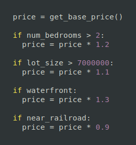
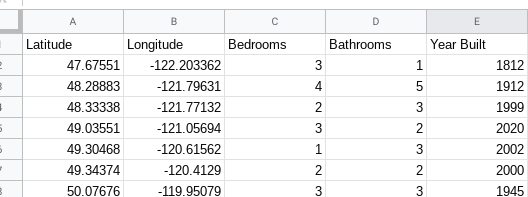
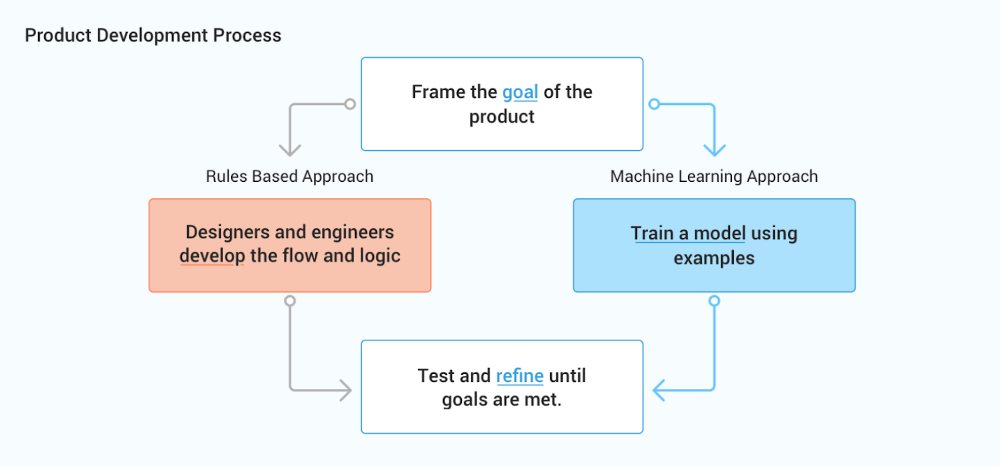
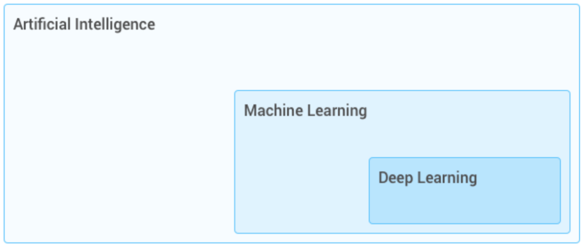

# Applied Machine Learning Intensive

<!--

Welcome to the Applied Machine Learning Intensive. In this course we will explore the concept of
machine learning and perform machine learning on a wide variety of tasks. We're glad you're
here and excited to explore this space with you.

-->

---

# Meet Your Instructors

<!--

First, let's take a moment to meet your instructional staff.

*Add slides and/or introduce any instructors and teachers assistants.*

-->

---

# Prerequisites

* Basic Python programming
* Basic matrix algebra
* Exposure to statistics and probability

<!--

We worked to have limited prerequisites for this course. For the most part we'll teach you
everything you need to know from the ground up. There are a few things, however, that we hope you've
already had exposure to. Those are listed on this slide.

If you don't know (or remember) these, don't panic. We have labs for all of the prerequisites.

For Python programming, we really only expect you to know the basics of the core language. It would
be good if you know `if`, `else`, `for`, `while`, the built-in data types, and how to create your
own functions. If you know list expansions and lambdas, even better! Also, if you already know
another programming language, but not Python, that is probably fine, too. Python is really easy to
learn, especially when you already have programming experience.

This is an applied course, but we will do a little math along the way.

For matrix algebra it would be nice if you knew how to add, subtract, and multiply matrices.
Understanding dot products and transpositions would be helpful, too.

For statistics and probability, we only lightly touch these concepts in the course. You should
understand concepts like mean and median. We will touch a little on probabilistic concepts as well. We
won't, however, get deep into t-tests and p-values.

-->

---

# Applied {.big}

*put to practical use as opposed to being theoretical*

<!--

Let's touch a bit more on what we'll actually be covering in this course by looking at the name of
the course.

The first word is 'Applied,' which means that we are going to put something to practical use. We
aren't going to create new algorithms or methods for machine learning. Instead, we will take 
well-known models and apply them to different data sets in order to get some practical outcome.

*Source: https://www.lexico.com/en/definition/applied

-->

---

# Machine Learning {.big}

<!--

What are we going to apply? We are going to apply machine learning techniques to data.

But what does this mean? What is machine learning?

*Prompt students to give their definitions of machine learning.*

-->

---

# Machine Learning

Algorithms learning from examples

<!--

Machine learning is all about algorithms learning from examples.

What does that mean? And how is it different from standard programming?

*Prompt the students to explain what 'learning from examples' means and how it is different from
traditional programming?*

-->

---

# Example: Home Prices

<!--

Let's go through a quick example of how traditional programming and machine learning are different.

Imagine you've been asked to create a home price predictor to help home sellers determine the
amount they should sell their homes for. How would a traditional program be created to do this?

Image Details:
* [home-for-sale.jpg](https://www.pexels.com/photo/white-and-brown-concrete-bungalow-under-clear-blue-sky-210617/): Pexels License

-->

---

# Example: Home Prices - Traditional Programming

<!--

With a traditional programming solution, programmers will do research, talk to subject matter
experts, and come up with an algorithm for determining how to price a home. They might make
adjustments for the number of bedrooms, lot size, and other features like the proximity to water
or to train tracks.

*Prompt the students to call out other features that might determine the price of a home. There
should be quite a few features called out. Make sure that at least 10 are mentioned.*

That was quite a list of attributes that might affect the price of a home. I'm sure that you know
of even more that weren't mentioned. The list is huge and it really becomes difficult to maintain.
It is fragile and is easily affected by the biases of the programmers, the amount of research work
done on the subject, and the number of conditionals that the programmers can maintain.

Image Details:
* [home-price-traditional.png](https://www.google.com): Copyright Google

-->

---

# Example: Home Prices - Machine Learning

<!--

Machine learning takes a different approach. With machine learning, programmers use proven model
algorithms that analyze data automatically. This analysis of the data 'trains' the model without
the programmers having to learn specific information about the data themselves.

Image Details:
* [home-data.jpg](http://www.google.com): Copyright Google

-->

---

## Learning from Examples

<!--

Machine learning uses examples to identify patterns and make predictions on new examples. 

Imagine if you brought a young child to the zoo, and upon arriving at the lion exhibit, the child pointed at a lion and said, “It’s a kitty!”

Image Details:
* [toddler.jpg](https://pixabay.com/photos/african-child-black-child-child-2578559/): Pixabay License

-->

---

## Learning from Examples

<!--

Would you be surprised? Maybe the child has not seen a lion before, but does have a kitten at home, so they said the closest thing they could think of.

Image Details:
* [kitten.jpg](https://unsplash.com/photos/2Nca6Aum17o): Usplash License

-->

---

## Learning from Examples

<!--

You inform the child that this animal is a lion and continue your day at the zoo.

Image Details:
* [lion.jpg](https://www.pexels.com/photo/lion-sleeping-beside-rock-1187987/): Pexels License

-->

---

## Learning from Examples

<!--
Later, you arrive at the tiger cage and the child now says, “It’s a lion!” (Perhaps they now think all big cats are lions.) You might clarify for the child that tigers have stripes, while lions don’t.

We expect children to learn from their surroundings, and when they get something wrong, we provide feedback to help them improve. The child's understanding of cats, lions, and tigers improves with feedback.

Similarly, machine learning makes predictions based on feedback while learning from examples.

Image Details:
* [tiger.jpg](https://pixabay.com/photos/animal-tiger-big-cat-safari-1868911/): Pixabay License

-->

---

## Learning from Examples

<!--

A machine learning algorithm might have a hard time determining whether this is a cat or a lion. But then again, so might the child from the zoo.

Image Details:
* [cat-lion.jpg](https://www.pxfuel.com/en/free-photo-xdsqg/): Creative Commons 0 License

-->

---

# Options

**Rules-based**

* Humans develop the logic flow
* If/then/else rules
* One-off exceptions
* Limited to human reasoning
* Exposes bias of the implementor

.

{.column}

**Machine Learning**

* Model trained with data
* Emergent patterns in the data
* Experiments and refinements in training and models
* Limited by training data
* Exposes bias of the training data

.

<!--

Before machine learning, many problems used a “rules-based approach," which makes predictions based on a list of rules. In some situations it’s useful to have this human input, but it’s challenging to maintain as new rules are needed for each change in user needs or ecosystem.

Consider the problem of deciding whether an animal picture is a lion. A rules-based approach might check for various things: if the animal has 2 ears, whiskers, walks on 4 legs, and is large. But what if you forget to include a rule for no stripes? What if the picture is of a lion cub, which isn’t large?

A machine learning approach would be able to look through a large number of examples to find the patterns of what a lion looks like without being explicitly told. ML systems are easier to update as user needs and the ecosystem changes. Some more advantages and disadvantages of both approaches are shown here.

-->

---

<!--

Machine learning is an iterative process that requires large amounts of data to learn useful, generalizable patterns. 

Your first step when approaching a problem should always be to define a clear, user-focused goal. Then, decide whether to take a rules-based or machine learning approach based on how the advantages of each fit your goal. (Generally, if you have a large amount of diverse data, machine learning is the way to go.)

No matter your approach, you’ll then need to test and refine your system until goals are met.

Image Details:
* [product-development-process.png](http://google.com): Copyright Google

-->

---

# Terminology

<!--

You'll encounter many terms in this class and in your machine learning work. Here’s an overview of some of the most important terms.

-->

---

# Artificial Intelligence {.big}

<!--

What is artificial intelligence?

-->

---

# Artificial Intelligence

machines that appear intelligent based on the tasks they perform

<!--

You might think of crazy robots like in “Ex Machina," or chatbots like Google Home, but AI is a very broad field. In fact, machine learning is actually a specific field of AI.

-->

---

# Machine Learning {.big}

<!--

What is machine learning then?

-->

---

# Machine Learning

a specific field of AI where a system learns to find patterns in examples, typically using statistics, in order to make predictions

<!--

Machine learning is a strategy through which AI can appear “intelligent” when performing tasks.

-->

--- 

# Deep Learning {.big}

<!--

“Deep learning” is a term that has become more and more widely used in recent years, due to the increasing availability of data.

-->

---

# Deep Learning

a machine learning approach that breaks a problem down into many pieces so it can learn more from the training data

<!--

Deep learning is a specific type of machine learning approach that gets its name from the large number of layers often used to build a neural network. Because these models are so complex, different layers can often learn different insights about the problem.

For example, a neural network classifying images of animals could have a layer that examines the colors in the image and another that looks for shapes. The insights from layers like these can be combined to identify, for example, whether an image shows a lion or a tiger.

-->

---

<!--

Sometimes these terms are used interchangeably, but that’s not quite correct. Deep learning is a specific technique in machine learning, which is a subfield in AI.

Image Details:
* [deep-learning-hierarchy.png](https://google.com): Copyright Google

-->

---

# Features {.big}

<!--

Now let’s dive deeper into what goes into a machine learning system.

-->

---

# Features

information drawn from examples which distinguish one example from another are the features in a machine learning system

<!--

For example, if we're trying to decide whether an image is of a lion or a tiger, useful features could be whether an animal has a mane or stripes. 

Some machine learning approaches (like deep learning) can automatically detect important features. But very often, you’ll need to define what features to include based on your specific goal.

-->

---

Video recommendation?

<!--

Say your goal is to give good video recommendations to viewers. What features or distinguishing information might be useful?

Examples include video topic, number of views, creator of video

-->

---

Price of a house?

<!--

What if your goal is to predict the price of a house?

Examples include location, number of bedrooms, size of property

-->

---

Which ad to display?

<!--

What if you’re predicting which ad to display to someone using google search?

Examples include user’s query, type of device, time of day

-->

---

# Model {.big}

<!--

These features are used in a model to make predictions.

-->

---

# Model

a mathematical way the patterns and insights that a machine learning system learns from examples and is used to make predictions

<!-- 

A model specifies how your machine learning system will actually learn patterns and insights. The model will then make predictions based on what it learned. Different models perform better on different problems. We’ll discuss several common types of models in a later lecture. For example, (price of house) = 100 * (square footage of house). If the house is 1500ft^2, then we forecast the price to be $150,000.

Concepts:
* models

-->

---

# Training {.big}

<!--

Teaching a model the difference between a lion photo and a tiger photo requires training data. Training data is a large set of examples related to the problem you are trying to solve. The model will make predictions based on the patterns found in the training data.

In one type of machine learning, known as supervised learning, the examples are labeled. For example, the title of an image could be "lion" or "not a lion." The model could use these titles as feedback, learning better how to classify images.

Especially with more data, models can become so complex that the details of how the model makes its predictions are difficult to understand. It’s important to continually evaluate and try to understand the output of your models. 

Concepts:
* models:training

-->

---

# Testing {.big}

<!--

Machine learning makes predictions on new data based on previous examples (training data). If your lion-detecting model adequately distinguishes lions from tigers, the model is performing successfully. If not, you can experiment with additional training data or other approaches to improve the results.

The data you use for testing should be representative of your problem and goal. Then your performance on the testing dataset should give you an idea of how your model will perform on totally new, real data.

Concepts:
* models:training

-->

---

# Overfitting {.big}

<!--

It’s important to always have a separate training dataset and testing dataset. If you observe high performance on the training data but lower performance on the separate testing data, it’s a sign of overfitting.

-->

---

# Overfitting

when a model conforms too much to its training data and cannot generalize to make predictions about new data.

<!--

Overfitting occurs when a model conforms too much to its training data and cannot generalize to make predictions about new data. For example, if none of the tigers in the training data have white fur, the model could assume all tigers have orange fur.

Just like the child from the zoo, a machine learning model will do the best it can with the information it has. Overfitting can be mitigated by looking for blind spots and bias in data and processes. It might also be a sign you need more training data. We’ll have a deeper discussion of how to improve performance of machine learning models, including reducing overfitting, later in the class.

Concepts:
* models:training:overfitting

-->
