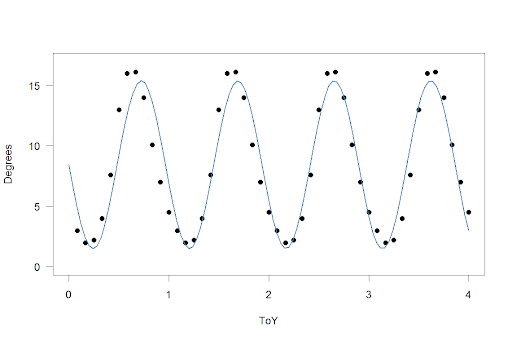

# Intro to ML Models

<!--
We've learned about machine learning and artificial intelligence at a very high level. In this
session we'll dive a little deeper and talk about what machine learning can do and what types of models support different problem domains.
-->

---

# What **can** Machine Learning do?

<!--
Though machine learning is not new, its application in modern life has really started to expand over the last decade. 

Quick discussion: What are some machine learning products that you know about? How has machine learning shown up and improved something you use?

*Give the class a few minutes to think of and call out answers. There should be a wide variety of answers. If not, give some examples like self-driving cars, language recognition, facial
recognition, and whatever else you can think of.*

Think of the diversity of applications of machine learning that we just mentioned. Given that
diversity, it is obvious machine learning is much more than just one thing. Yes, it involves
learning from data. But how it learns, what it learns, and what it can predict varies widely.

The machine learning community has settled on a few groupings of model types, each with different applications.
-->

---

# Classification
Determine which class or category an example belongs to using labeled data as a guide

<!--
Classification is a very common machine learning model type.

Classification systems determine which class or category an example belongs to. They can
distinguish between two or more classes. These classes are defined based on your goals for
the machine learning system.

For example, to answer the question, "Is this a lion?" you would choose the classes "yes" and
"no" (the problem of choosing between two classes is also called “binary classification”). To answer the question, "What type of cat is this?" you might choose the classes "lion," "tiger," and "kitten."

Classification can be used to identify objects in images or even identify whether credit card transactions are fraudulent or not.

-->

---

# Classification

<!--
This animation shows, mathematically, what a binary classification system is trying to do: given
data points from two classes (blue and red), learn some mathematical function that can separate
the two classes and predict which class a new data point is in.

The system can predict which class to apply to new data after training on existing data labeled
with the correct class. 

Quick discussion: What are some other examples of a classification system that you can think of?

*Very open ended. Possible answers: who is speaking right now, identify objects in images, label emails as spam*
-->

---

# Clustering
Find relationships between data, typically without a labeled training set

<!--
Clustering looks for similar examples in a dataset. It is an example of unsupervised machine
learning, or a system that does not require correct labels provided to learn. Instead, in the
process of clustering, a machine learning system defines categories and places examples into
each category by quantifying how closely examples are related to one another.

Clustering differs from classification because the categories are not defined by you. Clustering
systems propose their own categories based on patterns found in the examples. 
-->

---

# Clustering

<!--
For example, let’s say the child from the zoo wants to organize a photo album of many pictures
from the zoo. They don’t know a lot about animals, but they do notice that some are very small 
(reptiles, birds), some are medium sized (monkeys, seals) and some are very big (elephants, tigers). 
They might sort the pictures into three groups based on size. 

Clustering systems similarly attempt to find “clusters” of similar data examples.

Quick discussion: What are other examples of clustering you can think of? What features might a clustering system use to create clusters?
*Very open ended. Possible answers: suggesting similar videos, grouping many examples of soft drinks from around the world*
-->

---

# Regression
Predicting the relationship between multiple variables, where the target is continuous

<!--
Regression predicts the relationship between two or more variables. If you were interested in 
predicting the price of a house, you might look for patterns in location, square footage, or number
of bedrooms. While classification involves a discrete, categorical value to predict, regression
involves a continuous value to predict.
-->

---

# Regression

<!--
This graphic shows one simple type of regression, which tries to find the best-fitting line for
some data points, then makes predictions based on that line.
-->

---

# Regression

<!--
Regression may also discover a more complicated pattern, such as this sine-like pattern of sea
surface temperature every year.

Quick discussion: What are other examples of regression? What features might be useful for that
regression system?
*Possible answers: estimate arrival time based on traffic and distance, predict crop yield based on weather and time of year*

Note: *logistic* regression is a classification technique (with a binary target), and the similar names can be confusing. But typically, when we say "regression" we mean predicting a continuous variable.
-->

--- 

# Sequences
Suggest the next value in a sequence

<!--
Finally, sequence prediction suggests what might come next, based on previous examples.
-->

---

# Sequences

<!--
Autocomplete is an example of a sequence prediction: predicting what word is most likely to be
entered after typing part of a phrase.

Quick discussion: What are some other examples of sequence predictions?
* Possible answers: translations based on context, password strength (how predictable is the next letter from the previous ones), autocomplete, marketbasket* 
-->

---

# What **can't** Machine Learning do?

<!--
Machine learning is *not* magic, and ML is not a good fit for all problems. The principles underlying
machine learning are not new but are possible today because of the amount of available public data and
processing power. 

What can ML not do?

There are problems for which ML is not a good or viable solution. For example, if you don’t have enough
data or not enough diversity, ie, the data is so biased that you can’t generalize. And there are
problems that ML actually cannot solve.

Good ML problems:
* have a clear use case, 
* reflect developers' solid understanding of the problem, 
* use lots of historical data, 
* and require decisions, not just predictions.

Some examples of current limitations of ML are linked here: https://www.quora.com/What-can-machine-learning-do-and-cant-do) 
an ML system cannot infer a context-free grammar that generates the strings in a language. In other words,
an ML system can’t achieve true understanding of the grammar that generates a language the same way a human can. 
Similar to statistics or data science approaches, ML cannot be used to show cause-effect relationships. 
-->

---

What attributes of a dataset would you consider ideal?

* Large size / High diversity
* Large size / Low diversity
* Small size / High diversity
* Small size / Low diversity

Does the ordering of the data matter? Why?

<!--
One important consideration is the quality of data -- machine learning models are only as good as
the examples used to train them. 

What attributes of a dataset would be ideal? 
*(Correct answer is Large size / High diversity: A large number of examples that cover a variety of use cases is essential for a machine learning system to understand the underlying patterns in the data. A model trained on this type of
dataset is more likely to perform well on new data. But it also may take a long time to train.)*

Even if you have a lot of data, if it does not cover a variety of examples, a model will have lower
confidence for new data underrepresented in the training examples.

A small dataset with lots of variety makes it challenging to find patterns in the data. The predictions
will lack the confidence a larger dataset provides. And if your dataset is small without much variation,
you may not even need machine learning.

Does ordering of the data matter? 
*(Answer: Kind of)*

Ordering of the data matters when you might have groups of highly correlated examples. For example, if
you feed your ML system all pictures of lions, then all pictures of tigers, and so on, it may not be
able to learn general patterns as well. It’s extremely important to shuffle the training data to avoid
such groupings. Though, as long as you shuffle, the exact ordering after the shuffle does not matter.
-->
