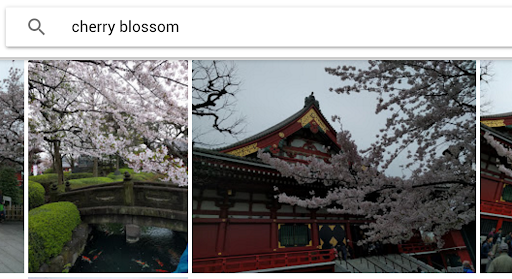

---

# Goals of This Class

* Learn to take a real-life problem and apply machine learning to make predictions.
* Learn to implement machine learning solutions using TensorFlow
* Learn how to evaluate the quality of your solution
* Machine learning is a very broad field -- we only just touch upon some of the most common machine learning algorithms

---

# Get to know each other!

* Find someone you don’t know and talk about what is your expectation of this ML course.
* You will introduce your partner and share your partner’s expectation briefly in 1-2 min.

---

# Applications

---

---

# Sample Applications of Machine Learning

* Medical applications such as disease prediction
* Speech recognition and understanding
* Recommendation systems
* Malware and spam detection
* Image understanding and annotation
* AI for games
* Translating between languages
* Predicting likelihood of earthquakes
* Matching resumes with jobs

<!--
Goal here is to make sure the students see the wide range of applications of machine learning.  First just some sample applications from a wide range of areas and then some explicit examples where ML is used at Google.
-->

---

# Google Products Using Machine Learning

---

# Google Assistant

<!--
Search - something we all us all the time
Voice recognition
Ranking - which pages to show
-->

---

# Google Photos: Searching Images via Text

<!--
Image collections are growing rapidly with digital cameras, especially our phones
Extremely hard to label every image to be able to find it when needed
There are people who do that
Google labels your pictures - allows you to search without ever adding a label
(Source: image: Photos taken by Wolff Dobson in Tokyo 2016 -- have permission to use here)
-->

---

# Gmail: Smart Reply

<!--
Smart Reply
A lunch invitation from a colleague
Makes good suggestions for simple replies to emails
-->

---

# Google Play Music: Recommending Music

<!--
Deep Learning is also used in everyday applications, like Google Play Music.
Here, it’s used to recommend artists you might enjoy
-->

---

# Game Playing: Alpha Go

<!--
Deep Learning can also be used to play games.
You might have heard of “DeepBlue” - the first computer to play chess at a championship level.
In 1997, it defeated the world champion - Garry Kasparov.
But to do it, DeepBlue used mostly brute force. In fact, it used an algorithm demonstrated by Claude Shannon, back in 1949! (recommendation: go read about Claude Shannon on Wikipedia)
-->

---

# Google Play Music: Recommending Music

---

# Combined Vision and Translation

<!--
Deep Learning can also be used for text recognition and translation
Machine Learning powers translation from and to 90+ different languages, in Google Translate.
-->

