# Polynomial Regression & Overfitting

---

# What Are We Doing Here?

1.  Remind ourselves of **Linear Regression**
1.  **Polynomial Regression**: what does it buy us…?
1.  Whoa - Caution! **Dangers** of polynomial regression!
1.  Regression vs. **Interpolation** (connect the dots!)

---

<!--
We have seen linear regression and have implemented it using multiple toolkits. We found our line using both the "closed form" solution and using optimizers such as gradient descent. Though linear regression can be a powerful predictive tool, it isn't appropriate for all types of regression problems.
-->

---

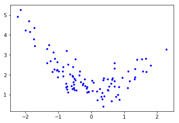

<!--
Take a look at this dataset for a few seconds and see if you can find a good spot to place a line.
-->

---

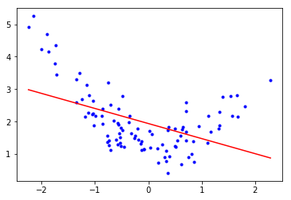

<!--
This is the line that the closed form of linear regression would create. It doesn't look like a very good fit does it? The r-squared score for this line is actually 0.2278666166017529.
-->

---

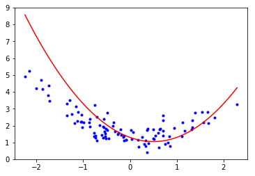

<!--
We can see that if we introduce a polynomial line (in this case a 2nd degree polynomial), we get a much better looking fit. The r-squared score is now 0.7900240657338337.
-->

---

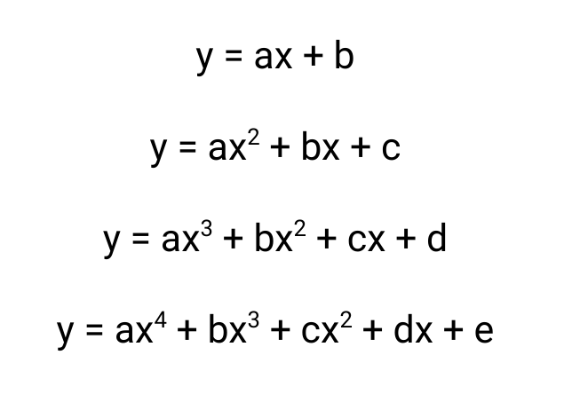

<!--
Here are a few examples of polynomial equations. The topmost is the linear equation that we know and love. The next is commonly called a "quadratic" equation. The third is a "cubic" equation. The number of factors you can add to equation is theoretically unbounded, though you'll pay a computational expense for very large equations and also introduce the risk of overfitting (which we'll talk about soon).
-->

---

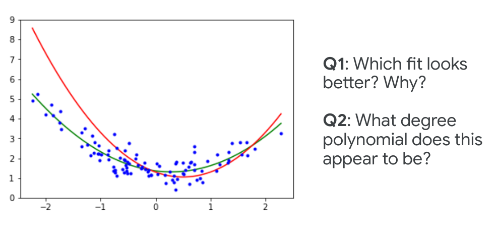

<!--
Have students talk to one another and answer the above two questions.
-->

---

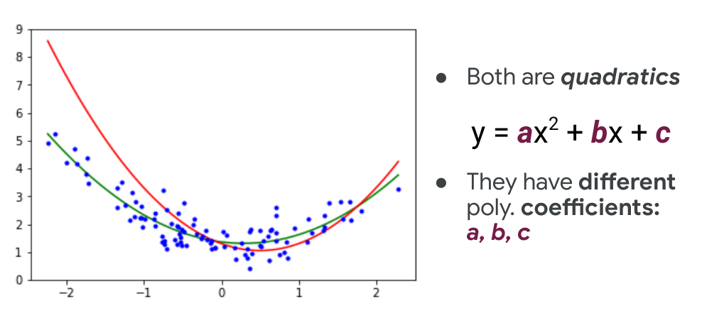

<!--
This dataset was actually randomly generated based on a polynomial equation with a bit of random noise. You can see that line drawn in green on the chart. Our red predicted line isn't perfect by any means, you can see a much sharper slope at both ends, but it is still better than a straight-line fit.
-->

---

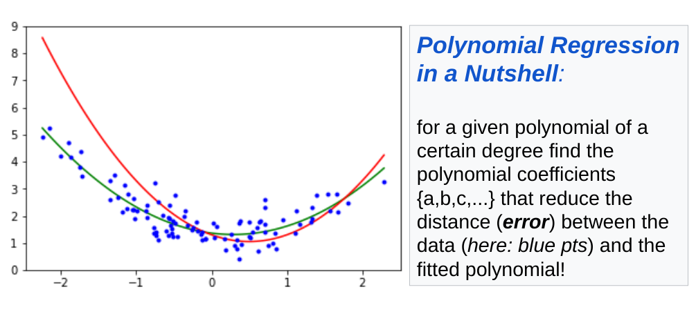

<!--
Have students talk to one another and answer the above two questions.

Transition remarks: we will now discuss using different order polynomials for regression and in particular explore potential dangers of using higher and higher order polynomial fits
-->

---

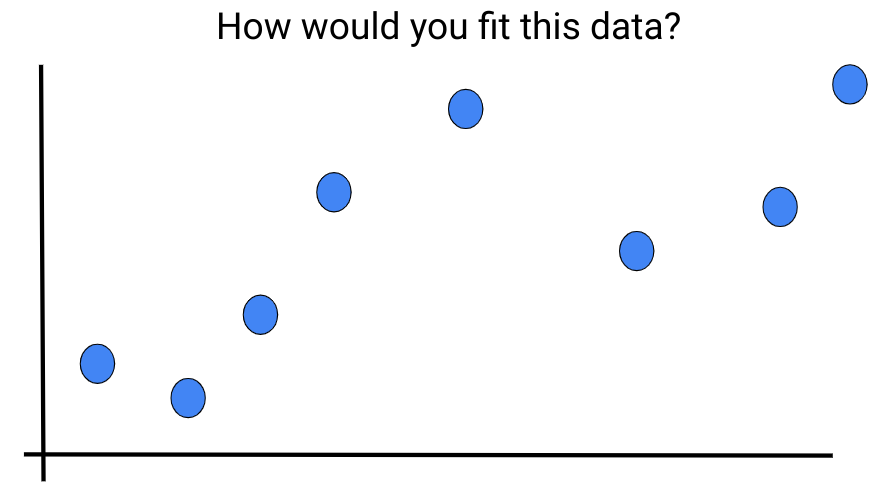

<!--
Question to students: What could go possibly go wrong if we use a polynomial to fit the following data? Have them brainstorm some ideas
-->

---

<!--
-Discuss which appear to be viable
-Pretend to throw one more data about in (B) in region where curve does not pass through to show one point could throw off entire fit!
-->

---

# Overfitting

---

<!--
Let's think of overfitting by looking into clothing. Here we have a person wearing a reasonably well-fitting suit.

Source: photo by NordWood Themes on Unsplash
-->

---

<!--
Clothing can be a little more form fitting, which reduces the number of people that it will fit. This is overfitting. You can think of it like a custom-tailored suit or a suit of armor.

Source: photo by Hugo L. Casanova on Unsplash
-->

---

<!--
There is the other extreme, where you make clothing so loose that just about anyone could cover up with it. This would be underfitting.
-->

---

<!--
Most of the time you just want a simple midsized unisex t-shirt of a model. It fits most of the time at the cost of being a little frumpy.
-->

---

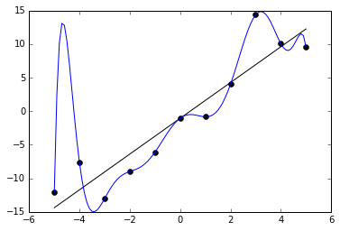

<!--
So how does this apply to real data? Here is an illustration of overfitting a regression model. You can see how the regression line perfectly fits the data points on the graph, but probably doesn't project well onto other x-values.

https://en.wikipedia.org/wiki/Overfitting
-->

---

How Do You Avoid This? {.big}

<!--
Given the problem of a polynomial fitting data too closely, how would you avoid overfitting.
Give the students some time to throw out some ideas.
-->

---

Avoiding Overfitting {.big}

* Simpler polynomial
* More training data
* Dropping out some training data
* Overfitting penalties (Regularization)

<!--
Here are some of the more common ways of avoiding overfitting.

Using a simpler polynomial function is one obvious way. If you model is introducing enough curvature to cross every training data point then remove some of the freedom of the model to adapt by reducing the polynomial space.

Another tactic is to use more data to train your model. As your dataset grows in size, it will likely also grow in diversity and create a model that is less overfit.

If you can't collect more data to train your model, it might be possible to drop some data out of the training set to reduce the ability for your model to overfit.

And finally, there are strategies for adding penalties to the model to make even a high-degree polynomial less likely to overfit. Some common strategies are called LASSO, Ridge, and ElasticNet. We'll look at each of these a little closer and you'll experiment with them in your lab exercise.
-->

---

# Regularization

<!--
Regularization is a method of "shrinking" the coefficients in the learned equation. There are two distinct types we will look at: Lasso and Ridge, as well as one type that somewhat merges the two.

https://medium.com/@yongddeng/regression-analysis-lasso-ridge-and-elastic-net-9e65dc61d6d3
-->

---

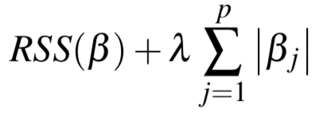
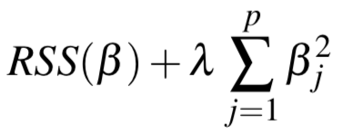
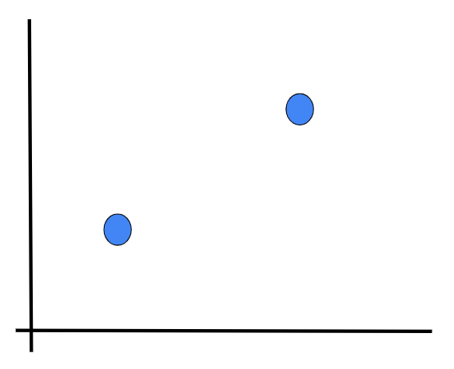
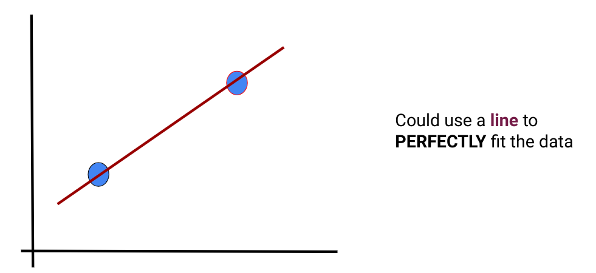
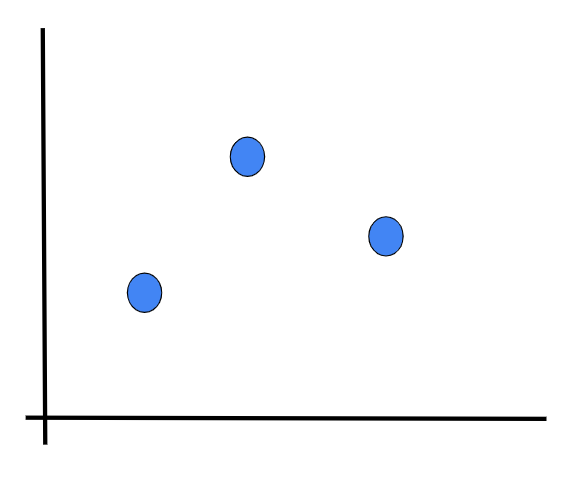

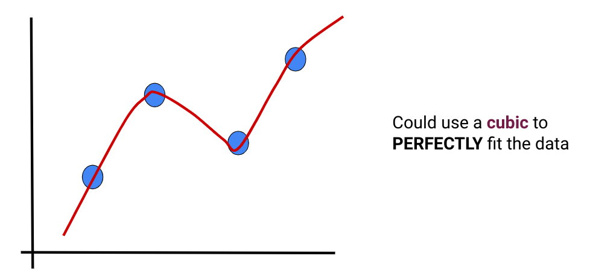

