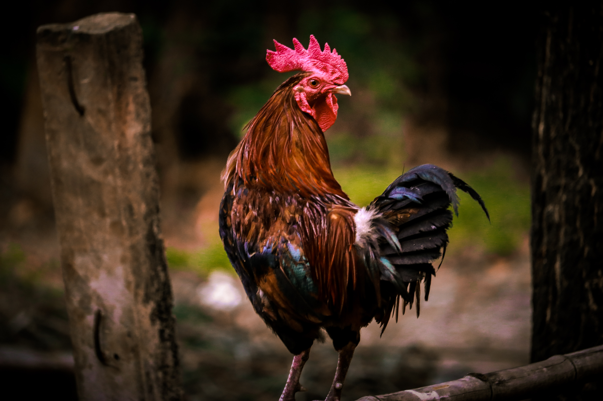
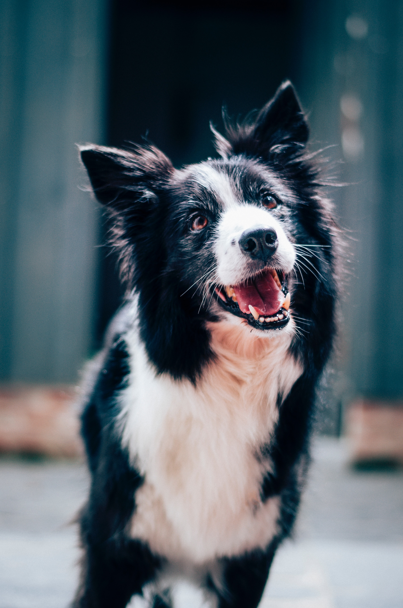
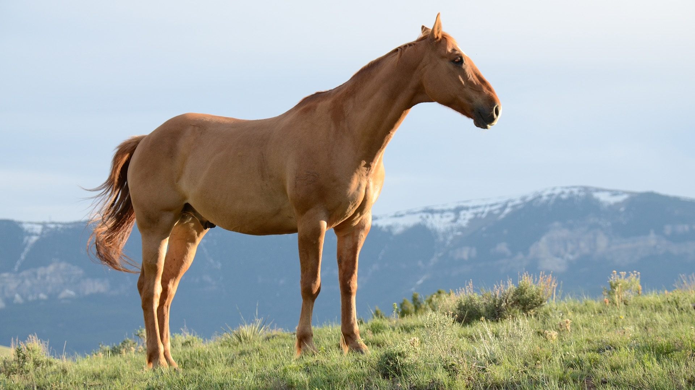
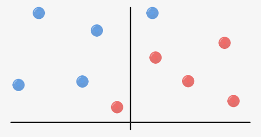
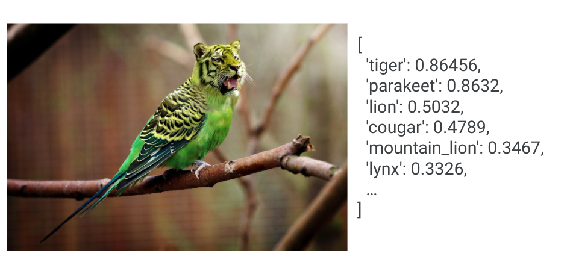
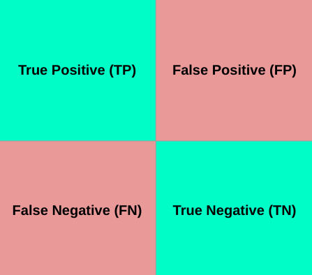
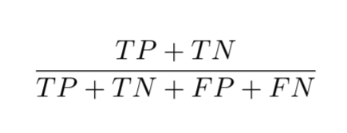
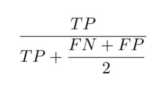

# Classification

---

<!--
food / pet / pest activity:
Pass out cards from either https://docs.google.com/document/d/1cvP1897NKnqxj0O8cPlaRAr58jSldOq2LL6Z4E4sYeI/edit (pet) or https://docs.google.com/document/d/15vKGW62h5UVrX6Fo3UGMmnqYhZLwRycEDMq6wxs2BSc/edit (food), depending on whether you want to consider horses food or pet.

These should be cut out so all images and the surrounding boxes with image labels are separate cards. Students work in groups to place each image in a corresponding label box.

When they’re done, come together and ask what they labeled chickens.

Source: Photo by Kazi Faiz Ahmed Jeem on Unsplash
-->

---

<!--
What did they label dogs?

Source: Photo by Baptist Standaert on Unsplash
-->

---

<!--
What did they label horses? (many cultures eat horse meat, so likely depends on whether you chose the [food] or [pet] cards)

Source: Photo by David Dibert on Unsplash
-->

---

<!--
Last week we explored linear regression. Recall that a linear regression attempts to fit a line to a data set in order to predict a continuous value.

We judge the quality of our regression by measuring the distance of the actual data from our prediction line. Measurements such as mean squared error (MSE), and root mean squared error (RMSE) are common.

We learned that optimal linear regressions can be calculated with a closed-form solution as long as the data set is small enough. We also learned about strategies for discovering the regression when working with large datasets that exceed the memory or computational limits of the closed-form solution (i.e. gradient descent). 
-->

---

<!--
This week we will move into a group of problems that don't rely on predicting a continuous value, but instead attempt to predict the "class" of a data point. These classification algorithms can be as simple as determining between two states, such as spam or not spam, through systems that determine the probability that a data point is one of dozens or even thousands of classes.

The 2-class model is often referred to as a "binary classifier". When more than two classes are being considered the problem is referred to as "multi-class classification". There are some algorithms that only work in binary classification states while others can be successful in both binary and multi-class applications.
-->

---

# What does it mean to classify?

<!--
Binary classification can be as simple as a yes/no decision as to which side of a "line" a data point falls on, but most of the time classification is presented as a list of confidences that a class applies to a data point.
-->

---

<!--
Classification model results are often returned as a list of confidences. The model will predict the probability that the given data point is part of each class. The model makes predictions. Your code will need to make decisions based on these decisions.

Notice that these confidences do not necessarily sum to 1, so they aren’t quite probabilities. You can perform a mathematical transformation, such as a “softmax” function, so you can interpret them as probabilities instead.

Source: Photo by Nick Karvounis on Unsplash
-->

---

<!--
Here is an example of a model returning confusing predictions. The model is decently confident that the picture contains both a parakeet and a tiger. What would you do?
-->

---

# Classification models

* Logistic Regression
* Nearest Neighbors
* Decision Trees
* Random Forests
* Naive Bayes
* Deep Learning

<!--
There are numerous models that can be used for classification. A few that we'll see over the course of this bootcamp are mentioned above.

Logistic regression: a variation of linear regression that performs a regression, then uses some threshold to make a classification decision
Nearest Neighbors: a distance measure is used to find the neighbors of a datapoint and classification decisions are made from those
Decision trees: a tree structure where a classification is made through a series of small decisions that ultimately lead to the leaf of a tree
Random forests: a group of trees, each with a random part of the training data, are queried and a consensus classification decision is made
Naive Bayes: Bayesian statistics applied to data to make a classification decision
Deep Learning: Neural networks trained to make classification decisions
-->

# Model performance

<!--
As mentioned before, determining the performance of a linear regression model is performed by measuring the distance between continuous values. In the case of classification models, there aren't any good continuous values to measure. Instead we count the number of predictions that the model got correct and the number that were incorrect. Using these counts we can then create various metrics that can be used to calculate model quality.

We’ll briefly cover the most common measures of classification performance now, and you’ll get more practice with these and more advanced measures later.
-->

---

Confusion matrix {.big}

<!--
Most of the performance measures that we look at will be based on values taken from the confusion matrix. For the sake of simplicity we'll stick to evaluating model quality for binary classification or at least from the perspective of a single class.

Think of the two classes as one “positive” and one “negative” class. False Positive means the model predicted “positive” but the correct class is “negative”, and vice versa for False Negative.
-->

---

Accuracy {.big}

<!--
Accuracy is a very basic measure of quantity. It is simply the number of predictions that the classifier got correct over the total number of predictions made.

Discuss how accuracy isn't a good measure, especially for skewed datasets (class imbalance: when positives or negatives are rare). Consider a dataset predicting some rare disease. In most cases, the disease isn't present so a model that always predicted the disease was not present would likely have a high accuracy.

Color blindness in women: 1 in 200, or .5% of women 
If my model always predicted false, what would be the accuracy?

***
Even with balanced classes accuracy is problematic because it ignores the context. Sometimes you care more about performance for one class vs. another. Depending on the consequences of your decision, you will use a different threshold to make the decision.

Ex: If you’re predicting a disease that would require invasive surgery, you will require a much higher probability for your classification as positive than if it only required recommending two aspirin. Or you might even have three different decisions although there are only two classes (sick vs. healthy): "go home and don't worry" vs. "run another test because the one we have is inconclusive" vs. "operate immediately".” 

https://stats.stackexchange.com/questions/312780/why-is-accuracy-not-the-best-measure-for-assessing-classification-models
-->

