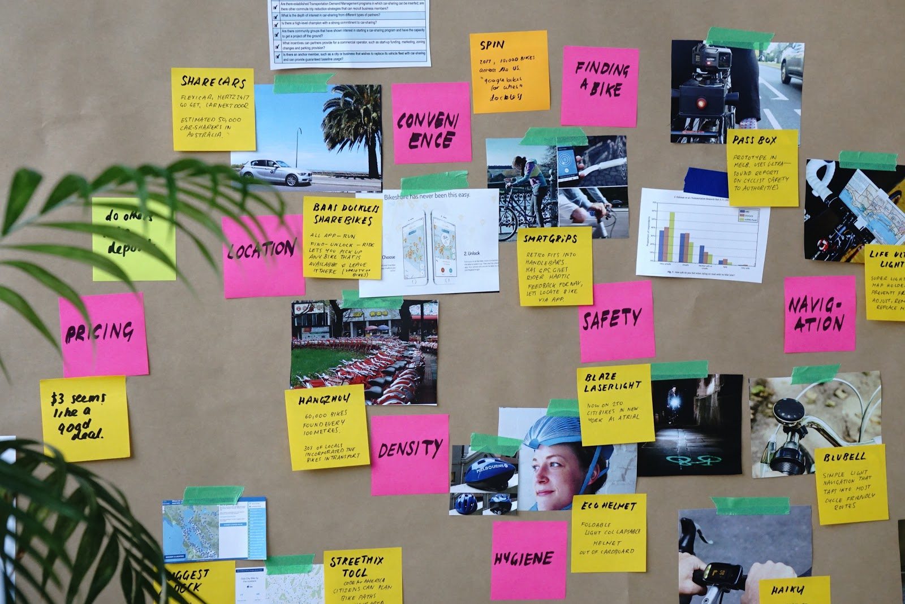
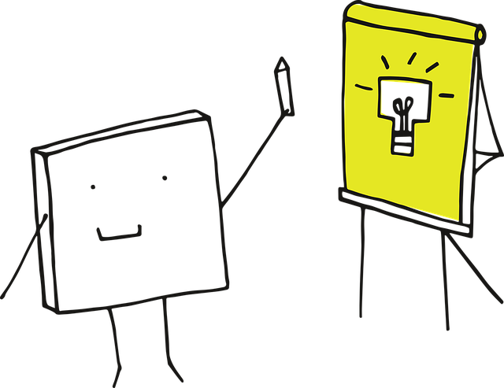
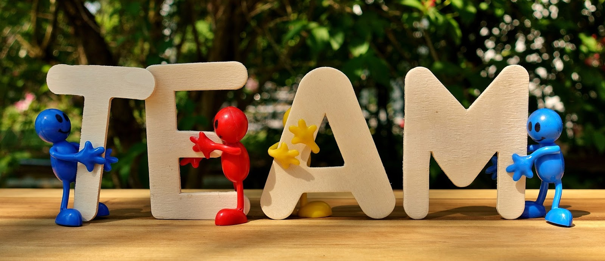

# Final Project Ideation

<!--
Materials needed:
Dot-stickers
Self stick easel pads (flipchart)
Colorful sharpies
Lots of post-it notes

Make sure to go over capstone project requirements and format before this activity
-->

---

# Brainstorming

1.  Defer judgment
1.  Encourage wild ideas
1.  Build on the ideas of others 
1.  Stay focused on the topic 
1.  One conversation at a time 
1.  Be visual 
1.  Go for quantity 

<!--
We’ll do 2 rounds of brainstorming: the first is very general, to give them practice brainstorming and get general ideas / areas of interest.
The second will be much more specific, focused on a specific idea.

For the first round, go over the brainstorming rules.
Read and elaborate on each one, highlighting their importance. For example:
Brainstorming should be completely judgement free
Crazy ideas are more than welcome (even if they are infeasible, they may inspire another great and more realistic idea)
Each idea should be on a single post-it note (no post-it notes with multiple ideas)
They should be as visual as possible. Sometimes just an image can be better than a description.

After going over the rules, make sure everyone has lots of markers and post-it notes at hand.
Set a timer for 3 minutes and tell them to come up with as many ideas as possible about what they want to do for their final project. 

Next step: Share out and cluster

Reference: The Field Guide to Human-Centered Design - A step-by-step guide that will get you solving problems like a designer. - By IDEO.org - http://www.designkit.org/resources/1 (pages 94-95)

You can get students to move around the class, maybe sit in groups or everybody gets up. Set a 3 minute timer and ask them to write down as many ideas as possible. Go for quantity, not quality. Be visual (images are better than words).
Watch: https://www.ideou.com/pages/brainstorming
Read: https://challenges.openideo.com/blog/seven-tips-on-better-brainstorming
More details on how to direct this activity: 
http://www.designkit.org/methods/1
http://www.designkit.org/methods/28

Source: photo by TeroVesalainen on Pixabay: https://pixabay.com/photos/thought-idea-innovation-imagination-2123970/
-->

---

# Group ideas by theme

<!--
Ask students to come up and share their ideas, one by one, sticking the post-it notes on the whiteboard (make sure there’s a large clean area).
You may way to ask all of them to get up and gather around the whiteboard, so it’s easier to hear each other and it’s more dynamic.

Make sure to enforce the “one conversation at a time.”
Anyone can start, and others should jump in and share similar ideas or build on the ideas of one another.

As they share out, ask them to start roughly clustering similar ideas.
 
After everyone shares their ideas, give them 5 minutes to group the ideas by theme (create or revise clusters and use markers to identify each cluster).

Next step: Frame a problem and brainstorm again.

For further reading on how to facilitate this part, look at pages 97-98 of the IDEO book.

Source: photo by Jo Szczepanska on Unsplash: https://unsplash.com/photos/bjemWZcNF34
-->

---

Narrow your problem and brainstorm again

How might we...?

{.background}

<!--
Now it’s time to narrow down a problem and brainstorm the idea that they are going to pitch. 
Each student should pick a theme or idea from the previous step and frame it as a “how might we” problem.
For example, suppose one of the ideas was “identify skin cancer,” which was grouped in the “healthcare” cluster. One might frame this problem as “How might we use machine learning to identify photos of skin cancer?” or yet “How might we make it easier for people to detect skin cancer early?”
This can then eventually become the idea for a mobile app that allows you to take pictures or moles or skin tags, and get a confidence interval of how likely that is to be skin cancer (All About Moles was one of the capstone projects for the pilot at Mills College)

Everyone should have the problem statement written down on a post-it note in front of them (one for each student, as this portion is also individual).
Then, set the timer for another 3 minutes and ask them to come up with ideas to solve that problem. It’s important to stay focused on the problem that they wrote down.

They will use these ideas to create a pitch. The best ideas will be selected and we will only form groups at the very end.

Next step: pitch your idea.

Further reading: pages 85-87 of IDEO book

Source: image by SplitShire from Pixabay: https://pixabay.com/photos/focus-telephoto-lens-lens-loupe-407244/ 
-->

---

# Pitch

The **WHO**
* Always start by introducing yourself.

The **WHAT**
* Describe your idea in one sentence.
* Tell people what makes your idea stand out, not in what way it’s similar to other things.
* Example: “Ridiculous Fishing is a game about fishing with machine guns.”

The **WHY**
* What’s the value proposition of your idea?

<!--
First, go over how to create a pitch. They will have 2 minutes to convey their idea and convince others of how awesome it is. A pitch must have:

Who: In one or 2 sentences, say who you are with a focus on what makes you qualified to lead the project that you’re proposing. More than that, you want to describe yourself in a way that the person will remember why you’re the most qualified person to make this happen.
What: This is the meat of the pitch. Describe your idea in one sentence.
Why: This is all about the value proposition. What are you adding, what are users getting they wouldn’t get otherwise? How will “what you’re pitching” achieve the value proposition. What is the reason for you to be offering them this value proposition. What are your reasons? Why should I care?

Source: image by OpenClipart-Vectors on Pixabay https://pixabay.com/vectors/fight-fist-mic-microphone-music-1296057/
-->

---

# Create your pitch

<!--

Distribute the self-stick flipchart paper and give them 15-20 minutes to create their pitch.
The who/what/why should be clearly stated on each paper (including the student’s name, this will be helpful during group formation).
Drawings and visual representations are always encouraged!

Source: image by Manfred Steger from Pixabay: https://pixabay.com/vectors/pixel-cells-idea-visualization-3976295/ 
-->

--- 

# Pitch

{.background}

<!--
Leave 45-60 minutes for pitches. Each pitch is 2 minutes. 
Assign a person to keep the timing.
Assign someone to put the posters up after each presentation. The posters should be clustered by themes, eg, put all posters of healthcare related ideas on 1 wall or corner, all posters with education related ideas on another, etc.

Source: image by freestocks-photos from Pixabay: https://pixabay.com/photos/audio-concert-mic-microphone-music-2941753/  
-->

---

# Vote

{.background}

<!--
After the pitches, distribute 3 dot stickers to each person. Give them 15 minutes to go around and review the ideas, ask questions, and vote. They can use their 3 votes however they want: they can vote in 1, 2, or 3 projects, and they may or may not vote on their own project. Their vote should reflect which projects they’d like to work on.

Source: photo by Paul Bence on Unsplash: https://unsplash.com/photos/11gPy_c8R8Y
-->

---

# Vote

<!--
We will form groups of 3 or 4. (make this a hard rule!)
Select the x most voted ideas and discard the posters that weren’t selected, where x is the number of groups. (Depending on the number of students, figure out how many groups of 3 or 4 you can form).

Announce the winning ideas and explain the group sizes and how many groups there needs to be. Given the constraints, let them go around the room and talk to their peers to form groups. Once a group is formed, write down their names and project, and give them the rest of the time to brainstorm and organize.

Source: image by Alexas_Fotos from Pixabay: https://pixabay.com/photos/team-teamwork-together-strategy-3393037/  
-->
