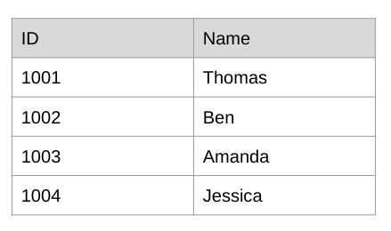

# Introduction to SQL

---

# History

* Short for Structured Query Language
* Pronounced S-Q-L or Sequel
* Developed in early 1970s in conjunction with the development of Relational Database
* Widely used and documented
* Standard?

<!--
SQL has been around since the 70s with the development of relational database.  Large companies developed a suite of tools and relational database servers, eg: Oracle, Sybase, Microsoft and Informix.  It was a popular foundation for data storage for many industries, such as Finance, Healthcare, Retail, etc.
More recently the open source MySQL is a more popular option and can be hosted in the cloud.  Cloud providers supports instances of MySQL such as AWS, Azure and Google Cloud
Standard?
* While standard SQL exists, often each vendors have added their own of extensions that it’s sometime confusing to keep track of
* For the SQL query to be portable across system, it needs to be written without using vendor specific extensions
-->

---

# Groups of operations

* Data Definition Language (DDL)
  * CREATE, DROP, ALTER

* Data Manipulation Language (DML)
  * INSERT, UPDATE, DELETE

* Data Control Language (DCL)
  * GRANT, REVOKE

<!--
* SQL queries often categorized into several type database operations
  * DDL - mainly for managing database objects -- Create & Drop (delete) table for example, Alter
  * DML - for managing rows of data -- Insert & Delete: create or delete rows of data *Update: modify the values of one or more columns of row data
  * DCL - for managing access to the database objects -- Grant & Revoke: read or write access
  -->
  
  ---
  
# Query

* Data Query Language (DQL)
  * **SELECT** COLUMN(S)
  * **FROM** TABLE(S)
  
<!--
And the most common is DQL - which is for selecting the appropriate subset of data that we need
* The basic syntax is SELECT one or more columns FROM one or more tables
-->

---

# Table

Employee table

<!--
Here’s an example of tabular data - an employee table that we will use in the next slides:
It has 4 columns and 4 rows
The columns are:
* Employee ID
* Employee Name
* Employee Dept ID
* Employee Salary
-->

---

# Query

**SELECT** ID, Name **FROM** Employee

<!--
Let’s review our first query!
* This query follows the basic syntax of SELECT … FROM …
* In this case, it’s selecting:
   * 2 columns: ID and Name
  * From a table named Employee
  * Results in all the values of the columns ID and Name
-->

---

# Query

<!--
Here’s the output of the previous slide’s query
Any questions?
-->
