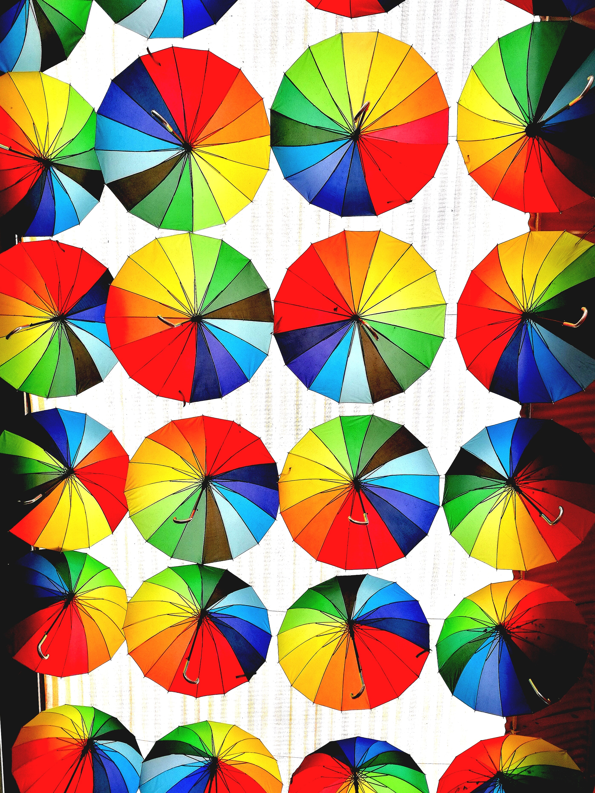
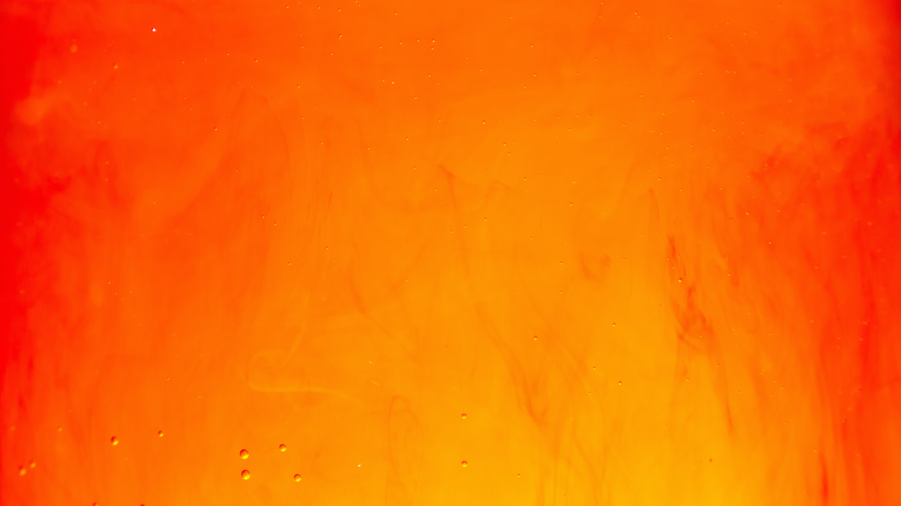

# CD-03: Working with Different Personality Styles

<!--
Today we’re going to learn about a tool for understanding work styles, both ours and others. This tool is called True Colors, and it’s a widely-known and utilized model at Google for understanding how teams can work better together. Today we’ll: 

* Identify your work style preference using one widely-known model at Google called COLORS
* Identify and appreciate other work style preferences
* Discover ways to flex to work more effectively on a team
-->

---

Have you ever taken a personality test? {.big}

Which one? {.big}

<!--
Have you ever taken a personality test? If so, which one? Did you think it accurately reflected your personality? Why or why not?
-->

--

# Warm-up exercise

* **ORANGE**: Describe a time when you took a risk… and it was thrilling.
* **GREEN**: Describe a time when you got really absorbed solving an intricate problem.
* **YELLOW**: Describe a time when you felt strongly committed to an organization or group of people.
* **BLUE**: Describe a time when you invested yourself in helping someone else to grow. 

<!--
[Each participant should have a fun/snack sized bag of M&Ms.]

Activity: “Pull out one M&M without looking. If it’s RED or BROWN, put it aside (or eat it). Depending on the color of M&M pulled, reflect on the corresponding item above (1 minute).  Now turn to a person next to you, and take 2 minutes each to share.”

Debrief: “Any interesting stories to share with the group briefly?”  (Take 2-3 volunteers.)  

Then wrap up the activity by stating the main takeaway:  “No matter what color M&M you may have picked, you would have been able to think of an instance in your life where that happened.  We are all a mix of these 4 traits -- all 4 traits (being risky, being analytical, being committed, being nurturing) exist in all of us.  Today’s session, we’ll take a look at a way to describe different personality types that will help you think about collaboration.”

Talk about why learning to work with different work styles is or has been important to you. (application at work, understanding self, understanding others, being yourself while also meeting others where they are.)
-->

---

# Why use COLORS as a tool?

* Simple and easy to apply
* Based on the same extensive research as Myers-Briggs (MBTI)
* Provides a common language for understanding ourselves and others at work

<!--
So why do we use True Colors as a tool? 

First, it’s easy to understand and apply. For those who have taken Myers-Briggs, you know it’s It’s complex!  This is quicker to grasp and easier to apply to ourselves and others in the workplace. In fact, Google’s engineering teams use Colors in leadership training. It’s a common language for discussion and learning within the company.

Also, it’s based on MBTI, which is extensively researched and has stood the test of time. 

It helps us better understand ourselves and others, which can save a lot of time and headache.
-->

---

# What are the four COLORS and what do they mean?

<!--
What are the four colors in True Colors and what do they mean?

Source: Photo by Burst on Unsplash
-->

---

# ORANGE
Flexible - Practical - Decisive - Adventurous

I am flexible, spontaneous, adventurous, and fun. I am a natural problem-solver, and I respond quickly and efficiently in a crisis. Because I show enthusiastic support for others, I am a source of encouragement for my team. 

* I will try out ideas now in draft and fix them later. 
* I need the freedom to act. 
* I am a good troubleshooter and negotiator. 
* I enjoy adventure and competition. 
* Keeping a good sense of humor is important to me.

<!--
Source: Photo by Lucas Benjamin on Unsplash
-->

---

# GOLD
Dependable - Loyal - Organized - Trustworthy

I am accountable and thorough. I dedicate time and energy to maintaining my organization. I provide stability and bring punctuality, order, and clarity of rules and regulations. 

* My ideal role is to plan ahead and follow a clear plan, step-by-step.
* I am organized, accurate, and dependable.
* I like checklists and clearly defined work.
* I am detail-oriented and process-driven.
* I appreciate order and punctuality.

<!--
Source: Photo by Katie Harp on Unsplash
-->

---

# Green 
Abstract - Private - Philosophical - Systematic

I am conceptual and an independent thinker. I like to develop models, explore ideas, or build systems to satisfy my need to deal with the innovative. I can be impatient with irrelevant personal interactions. 

* My ideal role is to conceptualize, strategize, solve problems, and invent.
* I am persistent and driven to understand. 
* I like data--analyzing and understanding systems. 
* I am a designer and inventor. 
* I prefer to work independently. 

<!--
Source: Photo by Jason Dent on Unsplash
-->

---

# BLUE
Blue - Perceptive - Nurturing - Harmonious - Optimistic

I value people in the organization and seek to draw out their full potential. My commitment to their personal and professional best generates loyalty. I am adept at motivating and interacting with others. 

* I am a "people person" and a team player.
* I like inspiring and motivating others. 
* I value harmony and cooperation. 
* I can change my color to suit the situation (chameleon). 
* My ideal role is to harmonize, inspire, communicate, and create.

---

# Exercise #1: Determine your colors

Step 1: Look over color description handout
Step 2: Do self-assessment handout
Step 3: Determine your color  

<!--
Source: Photo by Mockaroon on Unsplash
-->

