# Intermediate Python

<!--
SciKit-learn and Tensorflow both require users to understand objects and inheritance for some common use cases. Intermediate Python introduces the concept of Object Oriented Programming (OOP) to prepare students for using the sciKit-learn and Tensorflow features that require object extension. List comprehension and lambdas are also included since they are popular Python features that can be very useful, especially during data prep and exploration. Finally, this unit introduces exceptions to help you write code that handles errors elegantly. 

Students will be able to:
* Use and identify cases for using lambda and list comprehension syntax.
* Identify when it is appropriate to design exceptions into their program.
* Create and work with classes, objects, and inheritance.

---

# **Object Oriented Programming** is a programming paradigm that organizes data into classes 

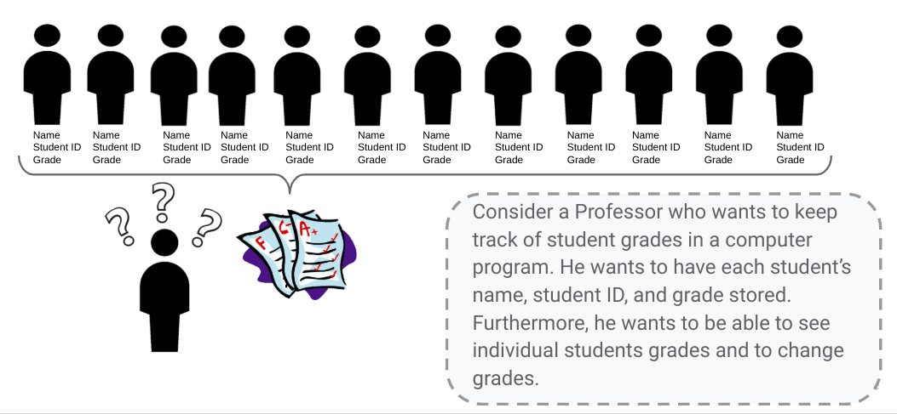

<!--
* What does “programming paradigm” mean?
  * It is a style of programming; object oriented programming is one particular style that organizes data into objects within classes.
  * Compare and contrast OOP with procedural and functional (procedural programming is mentioned on colab, so make sure to explain it and give examples so the distinction is clear)
  * Sometime when the data structures available are not complex or specialized enough, you need a class to hold your data!
* Ex. A teacher wants to create a program where they can keep track of students' grades
  * Wants a way to hold student id, grade
  * Wants methods to get a grade, change a grade, and print a grade
  * How could they organize all this capability in one program?!?!
-->

---

# We can use a **class** to create objects and methods that can be called them

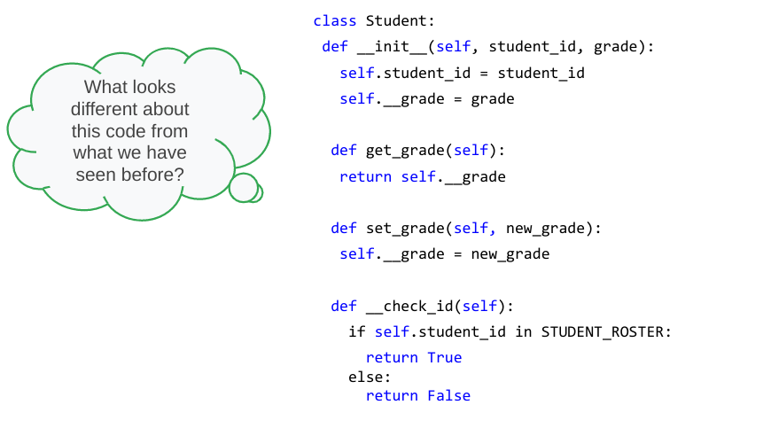

<!--
For the class:
Have students look at the code and decide what looks familiar/new and maybe even predict how those new items will work!
-->

---

# We can use a **class** to create objects and methods that can be called them

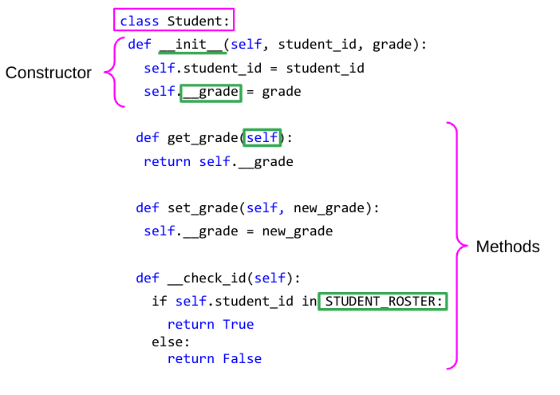

<!--
Motivation: Giving the students an idea of what a whole class would look like before we break it down so they can understand how the class might look together and identify pieces of code they don’t understand/ understand so they can know what to make sure to listen for in the coming slides!

For the class:
Looking at the code
* Class → keyword to tell python you are starting a class declaration, this is always followed by the class name and a colon
  * Everything following this declaration is like a blueprint for instances of this class
  * Shows the data each instance will hold + methods that can be called on it
* __init__ → called a constructor for a class
  * Every class is required to have one, shows the data each object of a class will hold
  * Note: it is a private member - we will learn more about this later!
* __grade: indicates that grade is a private member variable (it can’t be accessed or edited outside of the class). More about this later!
* Self → used to refer to objects in a class
  *  When “self” is an argument coming into a method, you don’t actually need to include that when calling the method
  * “Self” is implied as the instance of the class you declare before the dot
* STUDENT_ROSTER → a constant value. In this case, presumably a constant list of students in the class.
* Methods → collection of functions that can be run on an object of a given class
-->

--- 

# We can use a **class** to create objects and methods that can be called them

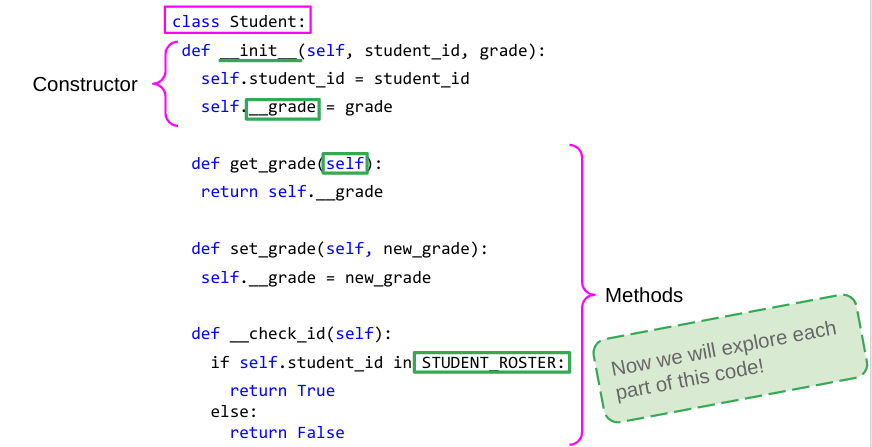

<!--
Motivation: Giving the students an idea of what a whole class would look like before we break it down so they can understand how the class might look together and identify pieces of code they don’t understand/ understand so they can know what to make sure to listen for in the coming slides!

For the class:
Let them know that we will now break it all down!
-->

--- 

# You can create a singular **“instance”** of a class...

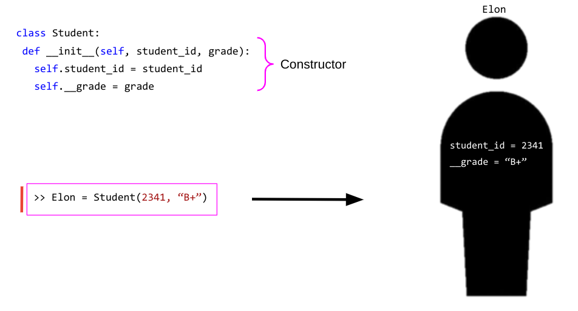

<!--
Motivation: Giving the students an introduction to a constructor and how an instance/object is created!

For the class:
* instances are the actual object, ie, the actual physical representation in memory of a “thing” of the type defined by the class
* Syntax → Created using the name of the class and the data members required for that instance in order of how they are in the constructor
  * Every class needs a constructor to show the computer what data members it should be allocating memory for every time an instance is created
* Now that we have an instance of a class we can manipulate that instance with methods defined in the class
* “Elon” is an instance of our class
-->

---

# Now that we have an instance, we can call **methods** on it

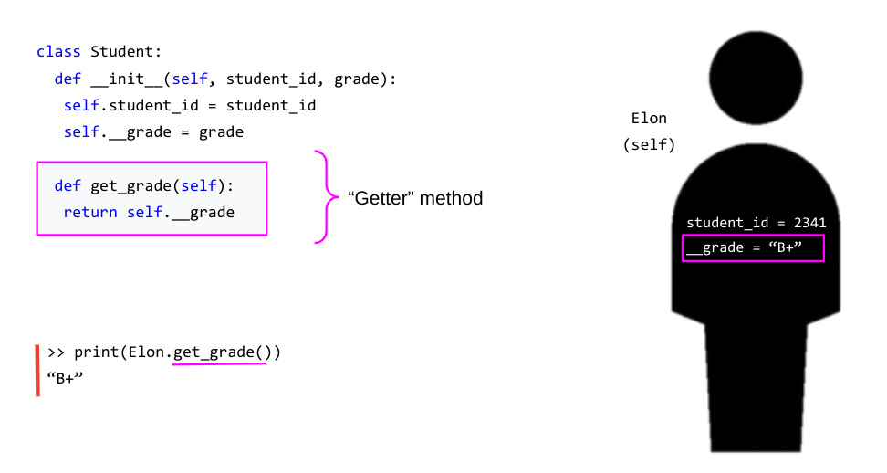

<!--
Motivation: Giving the students an introduction to how a method in a class interacts with instances.

For the class:
* This is an example of how a function can be called on an instance of a class
* Notice how you call the function
  * When “self” is an argument coming into a method, you don’t actually need to include that when calling the method
  * “Self” is implied as the instance of the class you declare before the dot 
* This type of method is called a “getter” method, it is used to get access to variables in a class
  * We will see why this might be necessary later!
-->

---

# We can create methods that manipulate our instance

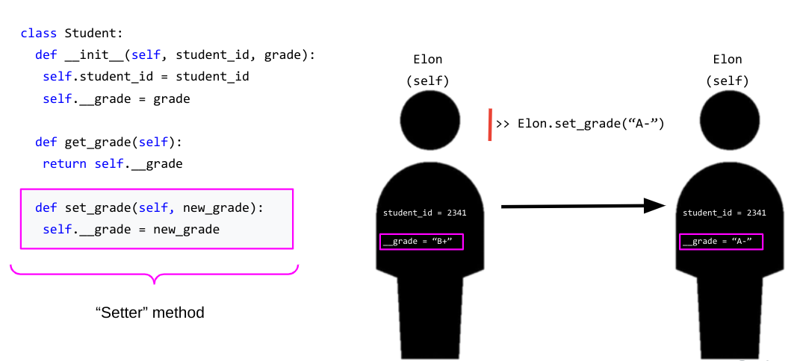

<!--
Motivation: Giving the students an introduction to using methods to manipulate instances

For the class:
* This is an example of how a function can be created to change the data an instance of a class is representing
* Notice how you call the function
  * “Self” is still implied as Elon
  * However, this time we also need a new_grade and this is passed in as function arguments usually are in python
* This type of method is called a “setter” and we will see why later!
-->

---

# We can create helper functions that are only **internal** to the class

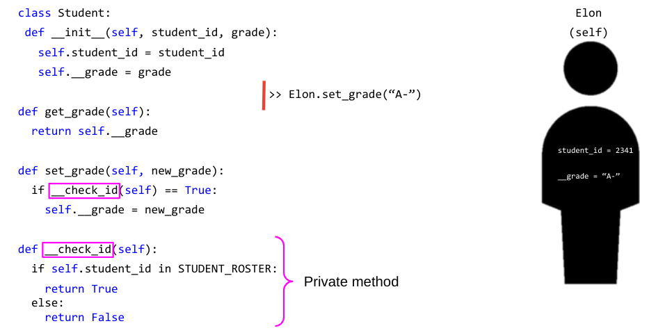

<!--
Motivation: Giving the students an introduction to using private methods

For the class:
* This is an instance of a private method!
* These are methods that are only helper methods to others in the class and cannot be accessed outside of it
  * Can be helpful for methods you want such
* We will go into more detail on these, later
-->

---

# We can create helper functions that are only internal to the class

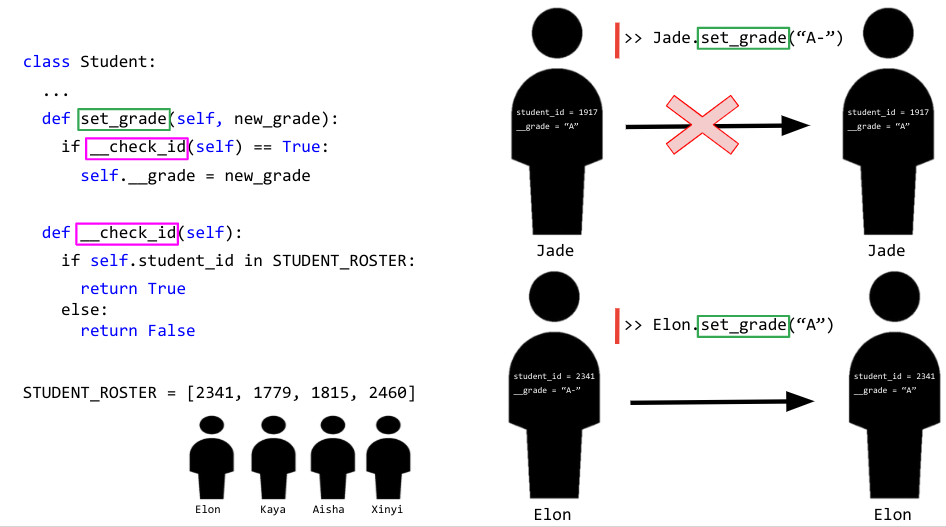

<!--
Motivation: Motivate why you would possibly want a private method

For the class:
Here we can see that having the private helper function can stop you from accidentally screwing up and adding a grade for an unknown student!
-->

---

# **Encapsulation** restricts access to variables and methods in a class

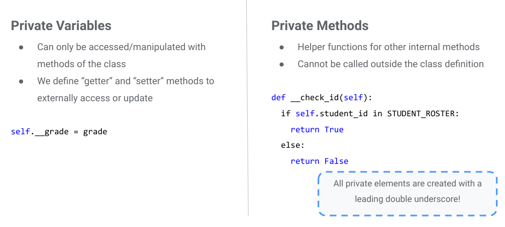

<!--
Motivation: Go more in depth into private variables + methods as those are often confusing

For the class:
* Remember the “getter” and “setter” method - this is why we had it!
  * Getters and setters allow safe ways to access private variables
* Private Methods allow you the ability to maintain functionality you want for helper functions while not allowing anything outside of the class to manipulate it in a way you do not want - more examples of this later will make it more clear what kind of use cases this is helpful for!

Helpful reads:
* See http://www.cems.uwe.ac.uk/~jsa/UMLJavaShortCourse09/CGOutput/Unit3/unit3(0809)/page_13.htm for a summary
* https://dbader.org/blog/meaning-of-underscores-in-python
-->

---

# **Encapsulation** restricts access to variables and methods in a class

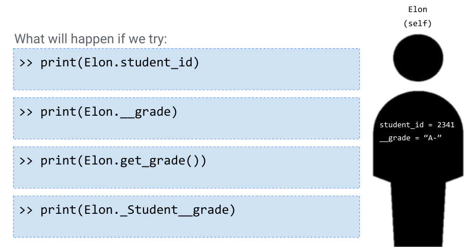

<!--
Motivation: Give a few examples of private methods to ensure they have an understanding of what work v. doesn’t practically

For the class:
Compare with a partner the  print() options
-->

---

# **Encapsulation** restricts access to variables and methods in a class

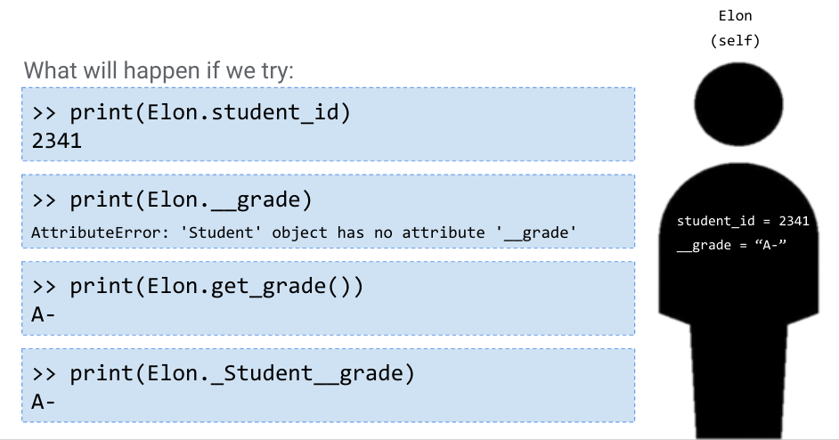

<!--
Motivation: Give a few examples of private methods to ensure they have an understanding of what work v. doesn’t practically

For the class:
Compare with a partner the  print() options
print(Elon.student_id) - this works! We’re just accessing a public member variable
print(Elon.__grade) - this doesn’t work! Our variable isn’t accessible outside of our class
print(Elon.get_grade()) - this does work, our method is accessible outside of our class and will return the grade!
print(Elon._Student__grade) - this does work, if you add the class name before it, you are allowed to access internal variables and Methods
-->

---

# Classes use **naming conventions** to tell you information about what element in the class a variable represents

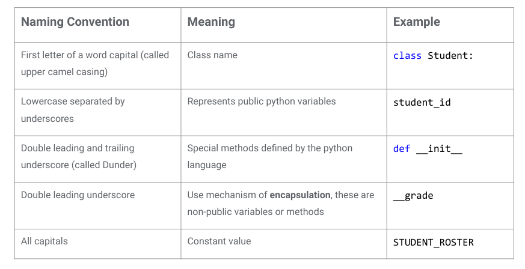

<!--
Motivation: Show the general naming conventions for python classes, as variable names are important here!

For the class:
* Go through them all, tell them to save this slide as a reference!
-->

---

# Functions outside of the class can interact with objects from the class

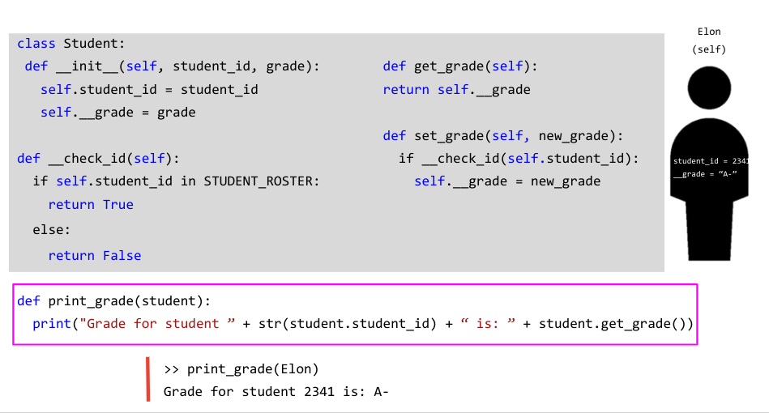

<!--
Motivation: Show how an outside function can interact with different parts of a class

For the class:
* You can add functions outside of classes that will interact with objects much like they do inside the class, just using Student instead of self
* NOTICE - How student_id and __grade are handled differently
-->

---

# Classes can **inherit** characteristics from other classes

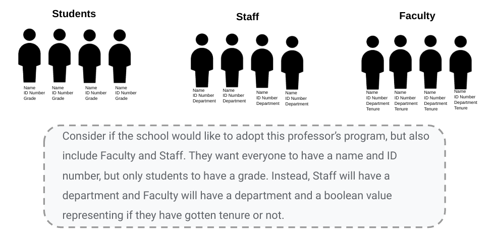

<!--
Motivation: Motivate inheritance as a way to have clarity + condense work when working with a number of types of instances

For the class:
Here we can see a scenario in which it could be helpful to have a way to make classes closely related as they share similar data structures!
-->

--- 

# We can use **inheritance** to create a hierarchical relationship between classes

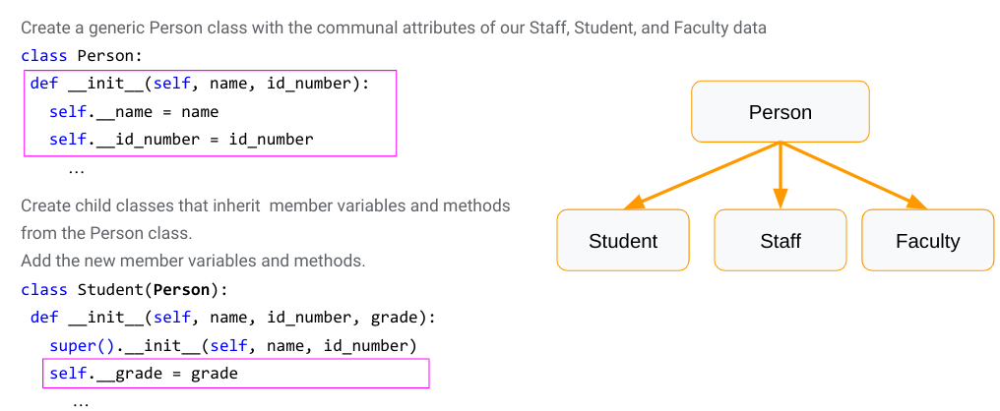

<!--
Motivation: Give an introduction to how to create the hierarchy with code

For the class:
* Inheritance structures are hierarchical relationships between classes
  * Can have any number of classes inherit from other classes + create complex hierarchies
* for now we will just look at one parent class with 3 child classes
* The child class inherits all characteristics of the parent class + you can add on
  * Look how we declare variables in Student(Person)
  * We get all the variables from super() and we can declare our own
* Note: A student is a person, but a person is not a student
  * Like - A square is a rectangle is a polygon, But not the other way around

Helpful reads:
* https://web.stanford.edu/class/archive/cs/cs106b/cs106b.1152/preview-inheritance.shtml
* http://www.jesshamrick.com/2011/05/18/an-introduction-to-classes-and-inheritance-in-python/
* Also Multiple inheritance in Python (https://pythonbasics.org/multiple-inheritance/)
-->

---

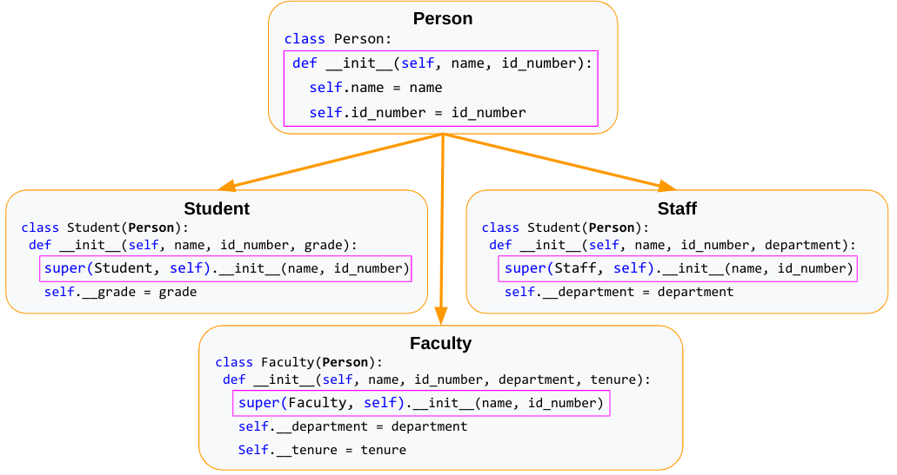

<!--
Motivation: Show how the code inits look for a few different options of variable declaration/expansion

For the class:
Walk through the different variables and reinforce the super() concept
-->

---

# Methods can also be inherited and can be overwritten by child classes

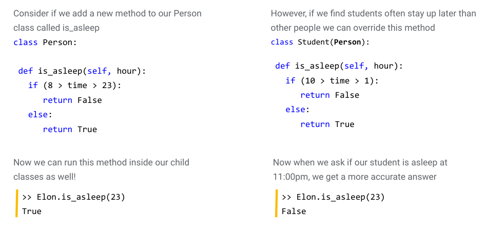

<!--
Motivation: Show how inherited methods work

For the class:
We can call them as normal on Elon our student
Or we can modify them inside a child class and override the parent method
-->

---

# You can use code in many ways to generate your own lists of data...

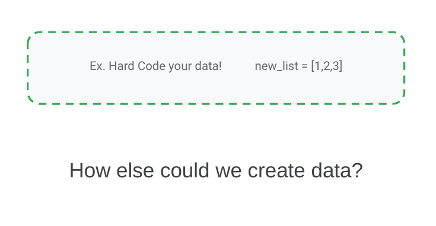

<!--
Motivation: Motivate creating data in a concise and easy way with list comprehensions

For the class:
* Talk with a partner about other ways we could create data other than directly hard coding our list
* Hints: 
 * what coding concepts are often used for repetitive actions like adding something to a list 
 * Can you think of a way to generate random data?
-->

---

# You can use code in many ways to generate your own lists of data...

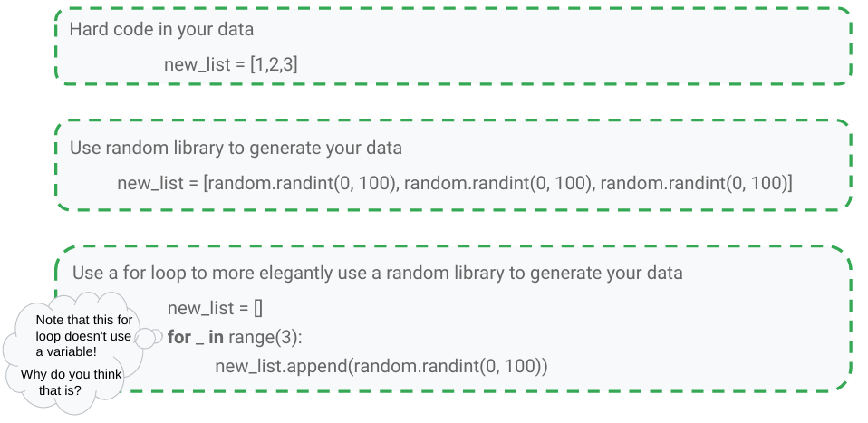

<!--
Motivation: Motivate creating data in a concise and easy way with list comprehensions

For the class:
* Walk through each way to generate a list of data
 * Note: for loop without the variable - we don’t even use the variable inside the for loop so we don’t have to declare one!
* None of these are that elegant.. Can we think of a more efficient way?
-->

---

# **List Comprehensions** are compact ways to create lists of data

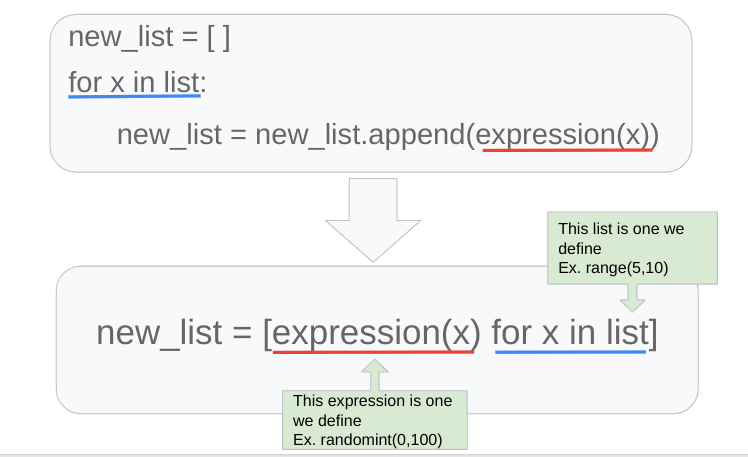

<!--
Motivation: Show list comprehensions in a structure that mirrors structures they are already familiar with

For the class:
* List comprehensions provide a concise way to create lists. 
* It consists of brackets containing an expression followed by a clause, then zero or more for or if clauses. The expressions can be anything, meaning you can put in all kinds of objects in lists.
* The result will be a new list resulting from evaluating the expression in the context of the for and if clauses which follow it.
* The list comprehension always returns a result list.
-->

---

# Try to make this code into a list comprehension

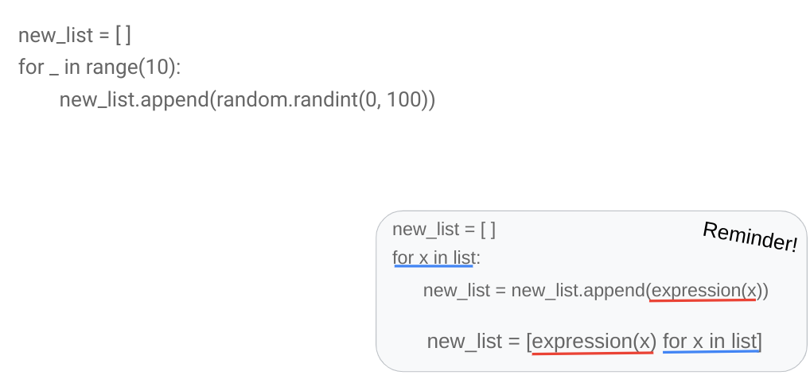

<!--
Motivation: Give them an easy way to get to know the syntax of list comprehensions

For the class:
Try to write the for loop we have into a list comprehension!
-->

---

# We can also write list comprehensions with conditional statements

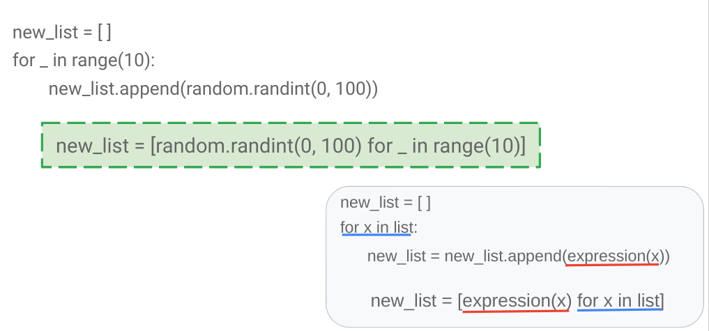

<!--
Motivation: Give them an easy way to get to know the syntax of list comprehensions

For the class:
We can see that it follows the exact formula in the bottom, and can still use our for loop without the variable!
--> 

--- 

# Try to make this code into a list comprehension

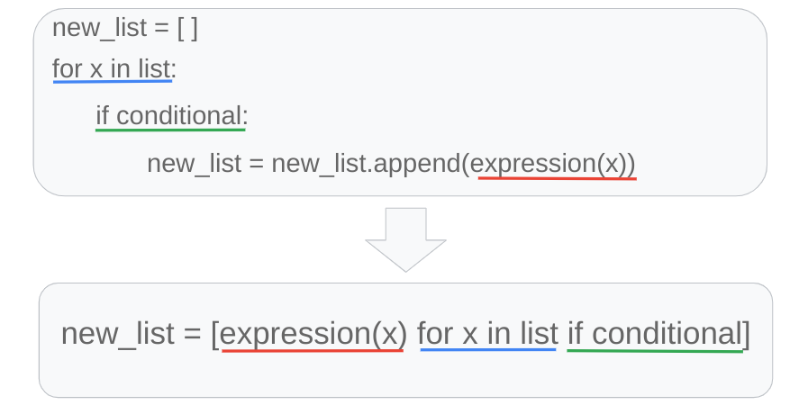

<!--
Motivation: Show how to incorporate conditionals into list comprehensions

For the class:
If you want to check something before adding it to the list, you can! 
-->

---

# Try to make this code into a list comprehension

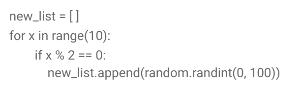

<!--
Motivation: Show how to incorporate conditionals into list comprehensions

For the class:
Try to make this into a list comprehension including the conditional statement 
-->

---

# Try to make this code into a list comprehension

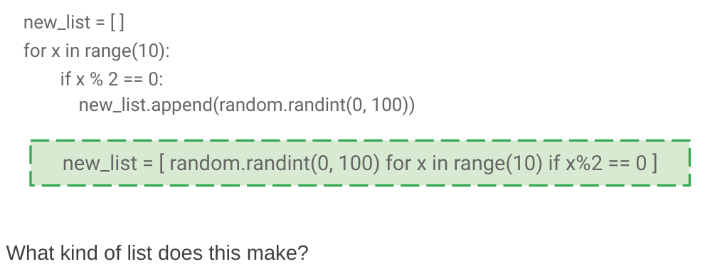

<!--
Motivation: Show how to incorporate conditionals into list comprehensions

For the class:
Here is the answer, what kind of list will we end up with?
-->

---

# Try to make this code into a list comprehension

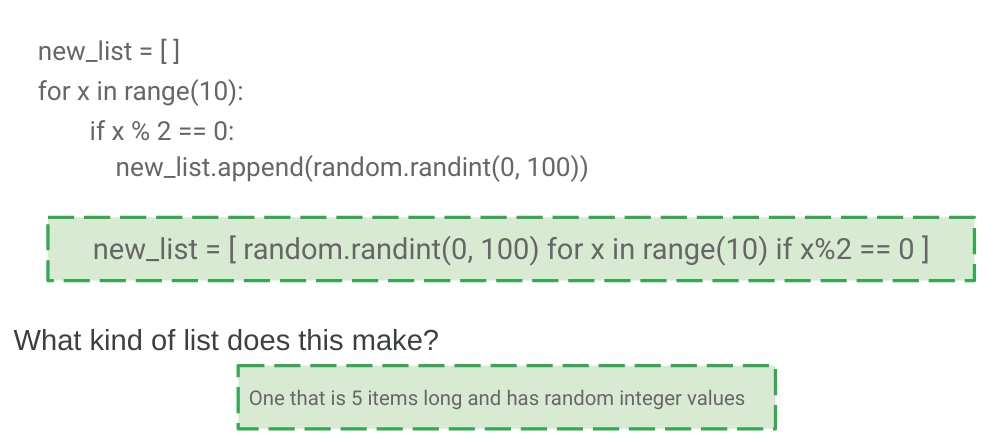

<!--
Motivation: Show how to incorporate conditionals into list comprehensions

For the class:
Because we added the condition that x had to be an even number (dividing by 2 gave no remainder) we only got 5 items in this list instead of 10 even though we called it in range(10)
-->
