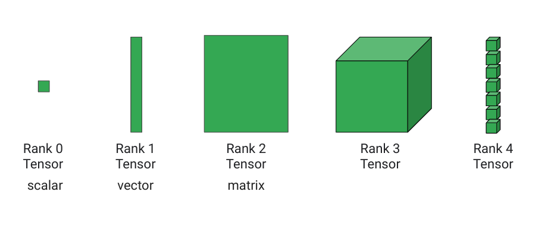
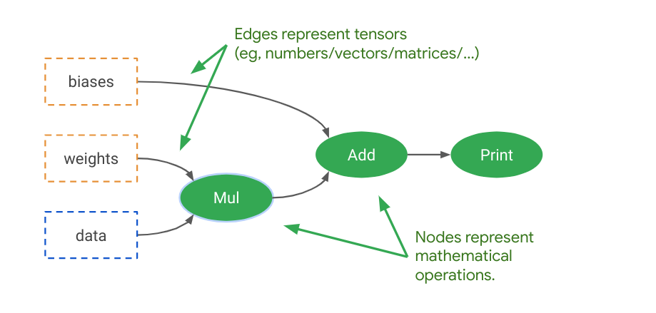

---

marp: true

---

# Introduction to TensorFlow
*An end-to-end open source machine learning platform*

<!--
It is time in our machine learning and data science journey to introduce you to TensorFlow. TensorFlow bills itself as "An end-to-end open source machine learning platform".

What does this actually mean?

"end-to-end" means that TensorFlow has tooling that allows you to start from nothing and build, train, validate, deploy, and maintain a model.

"open source" means that the code is freely available. You can look at how TensorFlow works on the inside if you desire. If you find a bug or need a feature, you can try to contribute code to change TensorFlow.

"machine learning platform" means TensorFlow was designed with machine learning in mind. TensorFlow isn't necessarily restricted to machine learning applications, but it is designed for them.
-->

---

# Why Do You Need TensorFlow?

* Neural Networks
* Distributed Computing
* GPU and TPU Support

<!--
We've been humming along pretty nicely performing machine learning tasks with NumPy, Pandas, and scikit-learn. Is TensorFlow really necessary?

We have indeed been able to do quite a bit with the tools that we've seen so far. What TensorFlow adds to the equation is better support for neural networks. Neural networks are the technology that is behind many of the breakthroughs in machine learning that we've seen in recent years. We'll learn more about neural networks soon.

TensorFlow also provides support for distributed computing. Machine learning algorithms thrive with big data. TensorFlow helps you process massive amounts of data, across machines if necessar.

TensorFlow also provides support for graphical processing units (GPU) and tensor processing units (TPU). These are specialized microprocessors that can really accelerate machine learning.

That being said, TensorFlow isn't the only toolkit that fills this space. Other options like Torch and Microsoft Cognitive Toolkit (CNTK), as well as many others provide power machine learning capabilities.
-->

---

# Tensor
*an N-dimensional array of data*

<!--
So where does the name TensorFlow come from?

In math, a simple number like 3 or 5 is called a scalar.

A vector is a one-dimensional array of numbers. In physics, a vector is something with magnitude and direction. In Computer Science, you use vector to mean 1D arrays.

A two-dimensional array is a matrix.

A three-dimensional array? These can be called cubes.

And four-dimensional? That is typically just called a 4d or Rank-4 tensor.

But it doesn't have to stop there. You can create tensors with an arbitrarily high number of dimensions.

So we now understand why the 'tensor' part of the name exists, but what about 'flow'.

Typically a sequence of operations is performed on tensors in a model. These tensors "flow" through the graph that constitutes the model, hench "TensorFlow".

Image Details:
* [res/introtensorflow1.png](http://www.oreilly.com): Unlicensed
-->

---

# TensorFlow: Graphs

<!--
TensorFlow internally constructs a graph of operations that it uses to perform machine learning tasks.

Image Details:
* [res/introtensorflow2.png](http://www.oreilly.com): Unlicensed
-->

---

# TensorFlow: Graphs

<!--
The edges of the graph represent tensors of data flowing through the graph.

Image Details:
* [res/introtensorflow3.png](http://www.oreilly.com): Unlicensed
-->

---

# TensorFlow: Graphs

<!--
These graphs pass through data in order to learning weights and biases.

Image Details:
* [res/introtensorflow4.png](http://www.oreilly.com): Unlicensed
-->

---

# TensorFlow: Versions

* TensorFlow 1
  * Lazy execution by default
  * Awkward programming model

* TensorFlow 2
  * Eager execution by default
  * Keras programming model

<!--
Version 1 of TensorFlow really emphasized the concept of graph. It used a 'lazy' execution model where you build a graph completely. This graph was then put into a session where data was passed through the model.

This programming model worked, but it was a little clunky. Luckily, a library called Keras showed that machine learning models could be built and training using a more natural eager execution model.

TensorFlow 2 was offically released in late 2019. TensorFlow 2 still supports much of the older programming model through a compatibality layer, but new programs should be written in TensorFlow 2 if possibly.

TensorFlow 1 also had the concept of Estimators. The interfaces are still supported in TensorFlow 2 and will continue to be for the indifinte futures.
-->

---

# TensorFlow is separated into abstraction layers

<!--
TensorFlow is actually not written in Python, but is instead a C++ library. The Python library that we use is a wrapper over the C++ with even more abstraction layers added on top of it. For this class we'll be using the "Core TensorFlow (Python)" layer and above.

Image Details:
* [res/introtensorflow8.png](http://www.oreilly.com): Unlicensed
-->

---

# The Lab

<!--
In this lab we'll get a brief introduction to tensors and operators. The goal is to get you familiar with working with the core objects of TensorFlow. Soon we will using higher-level APIs such as `Estimator` and `Keras`. The `Tensor` objects themselves are exposed in these higher-level APIs though, so it is a good idea to at least be familiar with them.
-->