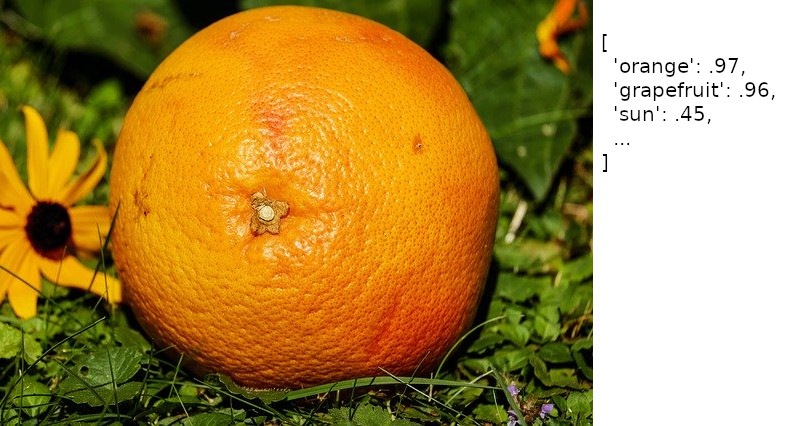
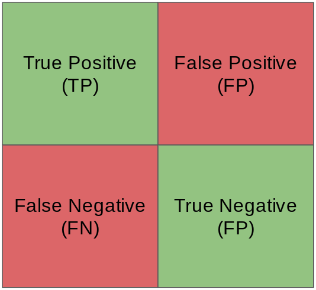
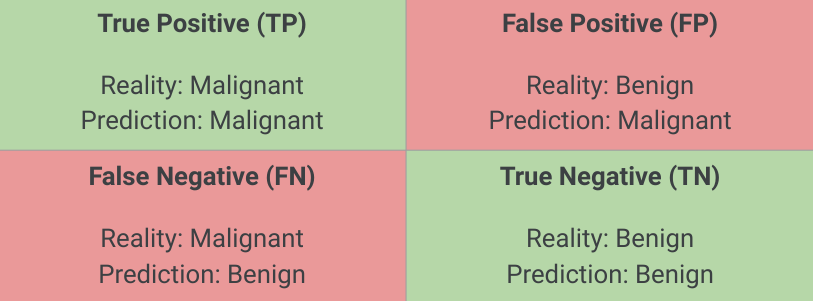
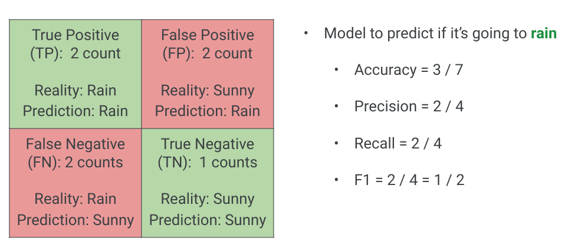

---
false
marp: true

---

# Classification

<!---
We are now shifting our focus away from regression and onto another applicaiton of machine learning: classification.
-->

---

# Classification vs. Regression

<!--
Recall that a regression attempts to predict a continuous value. In the illustration on this slide you can see a linear regression that attempts to fit a line to a dataset.

We judge the quality of our regression by measuring the distance of the actual data from our prediction line. Measurements such as mean squared error (MSE), and root mean squared error (RMSE) are common.

Image Details:
* [regression.gif](http://www.google.com): Copyright Google
-->

---

# Classification vs. Regression

<!--
Classification models don't predict a continuous value, but instead attempt to predict the "class" of a data point. These classification algorithms can be as simple as determining between two states, such as spam or not spam, through systems that determine the probability that a data point is one of dozens or even thousands of classes.

The 2-class model is often referred to as a "binary classifier". When more than two classes are being considered the problem is referred to as "multi-class classification". There are some algorithms that only work in binary classification states while others can be successful in both binary and multi-class applications.

In the illustration here you can see that we have two classes of data signified by the red and blue dots. We separate the classes using a line. All data on one side of the line is in the blue class and all data on the other side of the line is in the red class.

Image Details:
* [classification.gif](http://www.google.com): Copyright Google
-->

---

# What does it mean to classify?

<!--
Binary classification can be as simple as a yes/no decision as to which side of a "line" a data point falls on, but most of the time classification is presented as a list of confidences that a class applies to a data point.
-->

---

# Classification Confidence

<!--
Classification model results are often returned as a list of confidences. The model will predict the probability that the given data point is part of each class. The model makes predictions. Your code will need to make decisions based on these decisions.

Notice that these confidences do not necessarily sum to 1, so they aren’t quite probabilities. You can perform a mathematical transformation, such as a “softmax” function, so you can interpret them as probabilities instead.

Image Details:
* [tiger.png](https://unsplash.com/photos/-KNNQqX9rqY): Unsplash License
-->

---

# Classification Confidence

<!--
Here is an example of a model returning confusing predictions. The model is highly confident that the image contains either and orange or a grapefruit. What would you do in this situation?

Image Details:
* [grapefruit.png](https://pixabay.com/photos/grapefruit-fruit-vitamins-1647507/): Pixabay License
-->

---

# Classification models

* Logistic Regression
* Nearest Neighbors
* Decision Trees
* Random Forests
* Naive Bayes
* Deep Learning

<!--
There are numerous models that can be used for classification. Some of the more common ones that you'll see are mentioned here.

* Logistic regression: a variation of linear regression that performs a regression, then uses some threshold to make a classification decision
* Nearest Neighbors: a distance measure is used to find the neighbors of a datapoint and classification decisions are made from those
* Decision trees: a tree structure where a classification is made through a series of small decisions that ultimately lead to the leaf of a tree
* Random forests: a group of trees, each with a random part of the training data, are queried and a consensus classification decision is made
* Naive Bayes: Bayesian statistics applied to data to make a classification decision
* Deep Learning: Neural networks trained to make classification decisions
-->

---

# Model performance

<!--
As mentioned before, determining the performance of a regression model is performed by measuring the distance between continuous values. In the case of classification models, there aren't any good continuous values to measure. Instead we count the number of predictions that the model got correct and the number that were incorrect. Using these counts we can then create various metrics that can be used to calculate model quality.

We’ll briefly cover the most common measures of classification performance now, and you’ll get more practice with these and more advanced measures later.
-->

---

# Confusion matrix

<!--
Most of the performance measures that we look at will be based on values taken from the confusion matrix. For the sake of simplicity we'll stick to evaluating model quality for binary classification or at least from the perspective of a single class.

Think of the two classes as one “positive” and one “negative” class. False Positive means the model predicted “positive” but the correct class is “negative”, and vice versa for False Negative.

Image Details:
* [confusion_matrix.png](http://www.google.com): Copyright Google
-->

---

# Accuracy

* The fraction of predictions that a classification model got right
* In binary classification, the correct predictions by model is the sum of True Positive (TP) and True Negative (TN)

<!--
Accuracy is a very basic measure of quantity. It is simply the number of predictions that the classifier got correct over the total number of predictions made.

Discuss how accuracy isn't a good measure, especially for skewed datasets (class imbalance: when positives or negatives are rare). Consider a dataset predicting some rare disease. In most cases, the disease isn't present so a model that always predicted the disease was not present would likely have a high accuracy.

Color blindness in women: 1 in 200, or .5% of women
If my model always predicted false, what would be the accuracy?

***
Even with balanced classes accuracy is problematic because it ignores the context. Sometimes you care more about performance for one class vs. another. Depending on the consequences of your decision, you will use a different threshold to make the decision.

Ex: If you’re predicting a disease that would require invasive surgery, you will require a much higher probability for your classification as positive than if it only required recommending two aspirin. Or you might even have three different decisions although there are only two classes (sick vs. healthy): "go home and don't worry" vs. "run another test because the one we have is inconclusive" vs. "operate immediately".”

https://stats.stackexchange.com/questions/312780/why-is-accuracy-not-the-best-measure-for-assessing-classification-models

Image Details:
* [accuracy.png](http://www.google.com): Copyright Google
-->

---

# Precision

* The fraction of predictions that a classification model got right when predicting positive outcome
* Compute the fraction of **correct** positive outcome prediction out of **all** positive outcome predictions

<!--
In practice, you need more nuanced measures.

(Students will get more experience with this in the Classification Quality unit. Don't need to spend much time on it here. The slide is just showing that precision is a percentage of the positive cases that were actually correctly predicted over all of the positive case predictions.)

Precision: (true positive / all positive predictions)
When the model predicted positive, how often was it right?
Intuition: did the model classify as positive too often?

what happens if we classify everything as negative except for 1 that we’re 100% sure it’s positive?
100% precision

Write formula on the whiteboard

Image Details:
* [precision.png](http://www.google.com): Copyright Google
-->

---

# Recall

* The fraction of predictions that a classification model got right when out of all possible positive outcome
* Compute the fraction of correct positive outcome prediction out of all positive outcome predictions

<!--
(Students will get more experience with this in the Classification Quality unit.)
Recall: (true positive / all actual positive)
Out of all the possible positives, how many did the model correctly identify?
Intuition: Did it miss any positives?

Image Details:
* [recall.png](http://www.google.com): Copyright Google
-->

---

<!--
Balancing precision and recall is a tug-of-war between the metrics. Finding the optimal point where these two metrics are acceptable to your model is the goal.

If we want to increase recall, predict positive more often
If we want to increase precision, only predict positive when we’re absolutely sure (raise classification threshold)
In general, raising the classification threshold reduces false positives, thus raising precision.

Image Details:
* [tug_of_war.jpg](https://unsplash.com/photos/w55SpMmoPgE): Unsplash License
-->

---

# F1

* Harmonic mean of precision and recall
* High F1 means precision and recall are both high

<!--
What is a good way to determine if precision and recall are balanced? The F1 score computes the harmonic mean for the values. This formula penalizes small values of either, so optimizing for a high F1 score helps keep both precision and recall high.

Compare color blindness example: accuracy vs F1 when everyone is predicted as negative.

Expand formula to get optimized F1 (can calculate F1 directly from the TP/TN/FP/FN counts)

Image Details:
* [f1.png](http://www.google.com): Copyright Google
-->

---

# F1: optimized

<!--
The F1 formula can be reduced to this formula… math.

Image Details:
* [f1_optimized.png](http://www.google.com): Copyright Google
-->

---

# Which do I use?

<!--
The answer is "it depends".

In general accuracy isn't a good measure.

F1 is a good measure to balance precision and recall.

We’ll discuss more advanced measures later as well -- it is a good idea to measure the quality of your classifier using many different metrics and graphs, and sometimes directly reporting the confusion matrix is insightful
-->

---

# Confusion Matrix Example

Model to predict if a tumor is malignant

<!--
Let's get some practice calculating these metrics using a confusion matrix.

A confusion matrix is often used to describe how well a classification model performs on a dataset where true values are known.  It’s best to think of it as a table with 2 rows and 2 columns
It’s important to note what is the model trying to predict - which represents a “positive” outcome.  In this example the model is trying to predict if a tumor is malignant.  So positive outcome is a malignant tumor (though not positive in a human sense)

The 4 sections of the confusion matrix:
True Positive (TP)
Model predicts positive outcome (malignant) and it’s actually positive (malignant)
A hit scenario
True Negative (TN)
Model predicts negative outcome (benign) and it’s actually negative (benign)
False Positive (FP)
Model predicts positive outcome (malignant) and it’s actually negative (benign)
A false alarm scenario, also called Type I error
False Negative (FN)
Model predicts negative outcome (beningh) and it’s actually positive (malignant)
A miss scenario, also called Type II error

Image Details:
* [confusion_matrix_tumor1.png](http://www.google.com): Copyright Google
--> 

---

# Confusion Matrix Example

Model to predict if a tumor is malignant

<!--
Let’s calculate based on the following example data where we have:
1 count of TP
1 count of FP
8 counts of FN
90 counts of TN
The total number of predictions is 100 counts

Image Details:
* [confusion_matrix_tumor2.png](http://www.google.com): Copyright Google
-->

---

# Accuracy

<!--

Image Details:
* [confusion_matrix_tumor_accuracy.png](http://www.google.com): Copyright Google
-->

---

# Precision

<!--

Image Details:
* [confusion_matrix_tumor_precision.png](http://www.google.com): Copyright Google
-->

---

# Recall

<!--

Image Details:
* [confusion_matrix_tumor_recall.png](http://www.google.com): Copyright Google
-->

---

# F1

<!--
low because recall is low!
from previous slides:
precision = 1 / 2
recall = 1 / 9

Image Details:
* [confusion_matrix_tumor_f1.png](http://www.google.com): Copyright Google
-->

---

# Weather prediction

<!--
Practice calculations (these are the most common / important metrics to know for classification)

Image Details:
* [weather.png](http://www.google.com): Copyright Google
-->

---

# Your Turn

* Given that model to predict if it’s going to rain, construct a confusion matrix, and calculate:
  * Accuracy =
  * Precision =
  * Recall =
  * F1 =
  
<!--
Click back to previous slide to let students calculate
-->

---

# Solution

<!--
Image Details:
* [weather_solution.png](http://www.google.com): Copyright Google
-->

---

# Graphical Measurments

---

# Precision recall curve

<!--
Besides F1 score, detailed plots of precision vs. recall can also be used to pick where to find a balance. In this case there is a drastic decrease in recall as precision crosses 80%. Depending on your problem, you'll probably want to keep your model tuned to values close to 80% precision.

Talk with class about examples where recall or precision might be favored:
Hiring decision? --precision
Youtube: Marking inappropriate content (google youtube children), or copyrighted material. -- recall
Music / video recommendations? (is it better to play a song the user won’t like, or not play something they would?) --accuracy
Medical treatment? (what happens if a doctor sends you home and you have a terminal disease? What about when they run the exams just in case?) --recall
criminal justice risk assessment --precision 
Fraud / identity theft detection --recall ( every once in a while your card gets blocked or you get a call, specially if travelling or diff purchase behavior, because that’s cheaper than having to deal with the consequences of not detecting it early enough)

Point to importance of knowing how the algorithm got to that conclusion: compare early detection of schizophrenia vs criminal justice risk assessment 

Image Details:
* [precision_recall_curve.png](http://www.google.com): Unlicensed
-->
---

# Receiver Operating Characteristic (ROC) curve

<!--
Another curve used to visualize model quality is the ROC curve. ROC curve plots True Positive Rate (TPR, or recall) against False Positive Rate for various threshold values. FPR is (1 - the true negative rate).

The next slides will detail what these values are.

Image Details:
* [precision_recall_curve.png](http://www.google.com): Unlicensed
-->

---

# ROC: True positive rate == recall

<!--
The true positive rate in the ROC curve (y-axis) is exactly the recall. 

Image Details:
* [recall.png](http://www.google.com): Copyright Google
-->

---

# ROC: false positive rate

<!--
The false positive rate is one minus the true negative rate (TNR). TNR is also called specificity.

You can interpret this as how many actual negative examples were falsely predicted as positive.

Image Details:
* [specificity.png](http://www.google.com): Copyright Google
-->

---

# Receiver Operating Characteristic (ROC) curve

<!--
How do you tell if you have a good model? There is a calculation called Area Under Curve (AOC) or Area Under ROC (AUROC). Most toolkits will calculate this value for you. An AOC of 0.5 is a totally random classifier (dotted line) and an AOC of 1.0 is a perfect classifier.

ROC / AOC are complicated metrics that people often misinterpret -- an ideal graph curves high on the upper left and has an AOC closer to 1.0

Image Details:
* [roc_curve.png](http://www.google.com): Unlicensed
-->

---

# Cross entropy loss

<!--
Finally, recall our discussion of loss functions from earlier. For regression, common loss functions were L1 and L2 loss. For classification problems, the most common loss function is Cross Entropy Loss. This will be most useful in neural network models.

This loss function requires that your model outputs *probabilities* (i.e. the confidence for each class should sum to 1). Depending on the classification model used, you may need to apply a mathematical transformation to get a probability distribution. A common transformation is the softmax function: https://en.wikipedia.org/wiki/Softmax_function (you don’t need to get into the math, but if students are curious the formula is in the wiki). You may notice that softmax squashed the confidences closer together -- it preserves relative magnitude but doesn’t necessarily preserve the relative ratios.

Once you have a probability distribution, you calculate Cross Entropy Loss by adding together the log of the probability the model outputted for the correct class for each data point. Since lower loss is better for models, the negative of that sum is your cross entropy loss.

Image Details:
* [cross_entropy_loss.png](http://www.google.com): Copyright Google
-->

---

# Which do I use?

<!--
The answer is "it depends". It is a good idea to measure the quality of your classifier using many different metrics and graphs, as well as qualitative measures (looking through examples of what the model is predicting correctly and incorrectly).

In general accuracy isn't a good measure. F1 is a good measure to balance precision and recall.

The precision recall curve is best used when the positive case is rare or when false positives are more important than false negatives. In contrast, the ROC curve is best when the positive and negative cases are more balanced.

Cross entropy loss is most commonly used for more complex models, like neural networks.
-->
