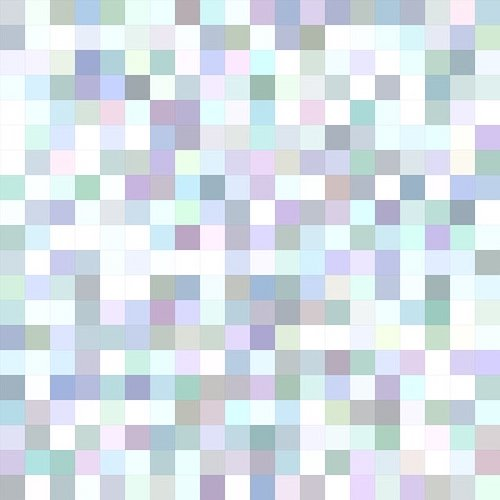
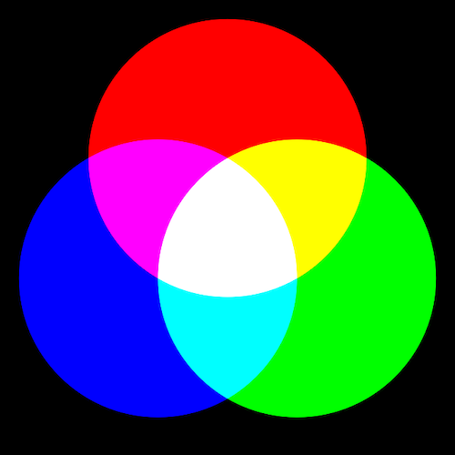
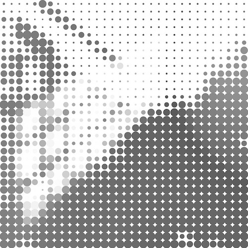
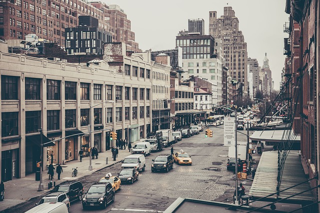
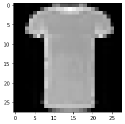

---

marp: true

---

# Introduction to Image Classification

<!--
We have performed binary and multiclass classification on datasets containing string and numeric values. In this unit we'll perform classification on images.
-->

---

# Image Features

<!--
What makes image classification different from other forms of classification? One major difference is the features. When classifying an image, each pixel is a feature. How are these pixels represented?

Image Details:
* [pixels.jpg](https://pixabay.com/illustrations/square-background-color-mosaic-2724369/): Pixabay License
-->

---

# Image Features

<!--
Often pixels are represented as RGB values. These are three numbers that indicate the amount of red, green, and blue in an image. These numbers often range from 0 to 255.

Image Details
* [rgb.png](https://pixabay.com/vectors/intersection-mix-colors-rgb-red-154782/): Pixabay License
-->

---

# Image Features

How many features would we have for a 1920 × 1920 image if the image was represented by RGB values?

<!--
Let's take a moment to think about the number of features we are dealing with there. Say we have a 1920 by 1920 pixel image. How many features would we have?
-->

---

# Image Features

$$ 1920 * 1920 * 3 = 11,059,200 $$

<!--
That's over 11 million input features!

We can think of the data as a 3-d matrix (or a tensor) with dimensions 1920 x 1920 x 3. 
-->

---

# Image Features

How many features would we have for a 12 megapixel image stored in RGB?

<!--
Let's try another one. How many features would we have for a 12 megapixel image stored in RGB?

This resolution (or greater) is common for mobile phones these days.
-->

---

# Image Features

$$ 12,000,000 * 3 = 36,000,000 $$

<!--
This is an insanely huge number of features. It is extremely difficult for a model to perform well with such a huge number of features. That is why you'll notice that the images we use in this lab are very low resolution.
-->

---

# Image Features: Grayscale

<!--
Another way to reduce the number of features is to convert them to grayscale. Grayscale uses a single number to represent the intensity of color in a pixel, but it doesn't specify the color. The range of values that you'll find vary. In this lab we work with one dataset that has a grayscale range of 0 through 255 and another that goes from 0 through 16. Grayscale values might even be in the range from 0.0 through 1.0. For neural networks this smaller range is easier to train on.

Image Details:
* [gray.jpg](https://pixabay.com/illustrations/abstract-graphic-pattern-grey-952691/): Pixabay License
-->

---

# Image Features: Other Formats

* HSV: Hue, Saturation, Value
* HSL: Hue, Saturation, Light
* CMYK: Cyan, Magenta, Yellow, Black
* BGR: Blue, Green, Red

<!--
There are more color models than RGB and grayscale. A few alternatives are listed in this slide.

You'll notice that some, like CMYK, have more values than RGB. BGR, on the other hand, is just RGB in a different order.
-->

---

# Image Classification: Busy Images

<!--
Another interesting aspect of image classification is that images rarely contain just a single item. Take this image, for instance. It contains buildings, cars, people, and more. With an image like this, it can be hard for the model to identify the important features. Sometimes this requires the researcher to pre-process and clean the images. Sometimes it requires additional model tuning. 

Image Details
* [street.jpg](https://pixabay.com/photos/city-street-traffic-cars-731239/): Pixabay License
-->

---

# Image Classification: Lab

<!--
In the lab for this unit, we'll be working with some very curated datasets. The first dataset we'll work with is the Fashion-MNIST dataset.

The dataset contains 70,000 images of different clothing items. Each image is a grayscale image, only contains one item, and is only 28x28 pixels.

Image Details:
* [shirt.png](https://github.com/zalandoresearch/fashion-mnist): MIT License
-->

---

# Image Classification: Lab

> Label	| Class
> ------|------------
> 0     | T-shirt/top
> 1     | Trouser
> 2     | Pullover
> 3     | Dress
> 4     | Coat
> 5     | Sandal
> 6     | Shirt
> 7     | Sneaker
> 8     | Bag
> 9     | Ankle boot

<!--
The images in the Fashion-MNIST dataset are labeled with one of the shown classes. The numeric label is the target of the model.
-->

---

# Image Classification: Lab

<!--
We'll also work with the MNIST digits dataset. This dataset contains handwritten digits that we'll classify as 0 through 9. This is also a very clean dataset with one digit per image.

Image Details:
* [digits.png](https://commons.wikimedia.org/wiki/File:MnistExamples.png): [Creative Commons Attribution-Share Alike 4.0 International license](https://creativecommons.org/licenses/by-sa/4.0/deed.en)
-->

---

# Image Classification: Lab

## Your Turn!

<!--
Now it is time for you to get some hands-on experience with image classification.
-->
