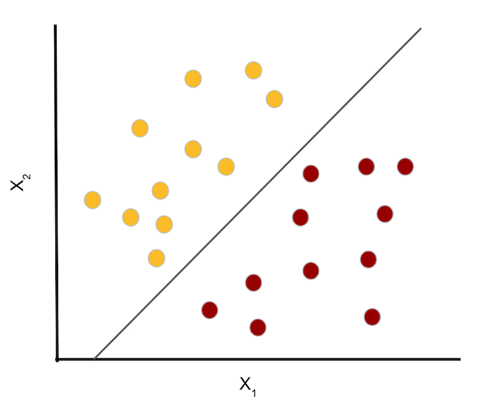
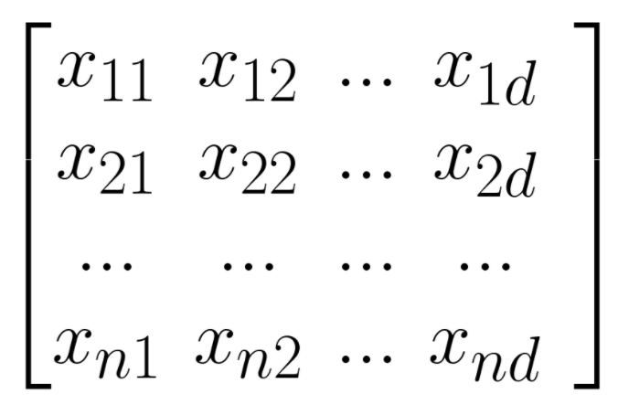
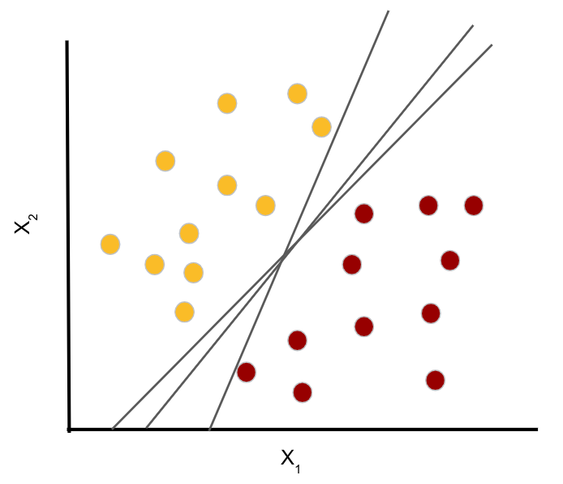
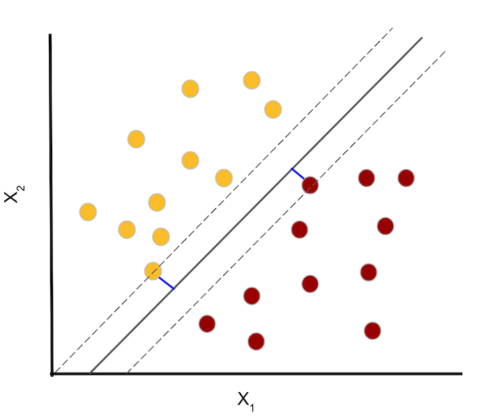
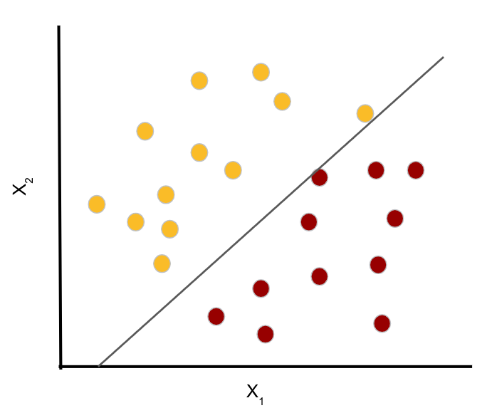
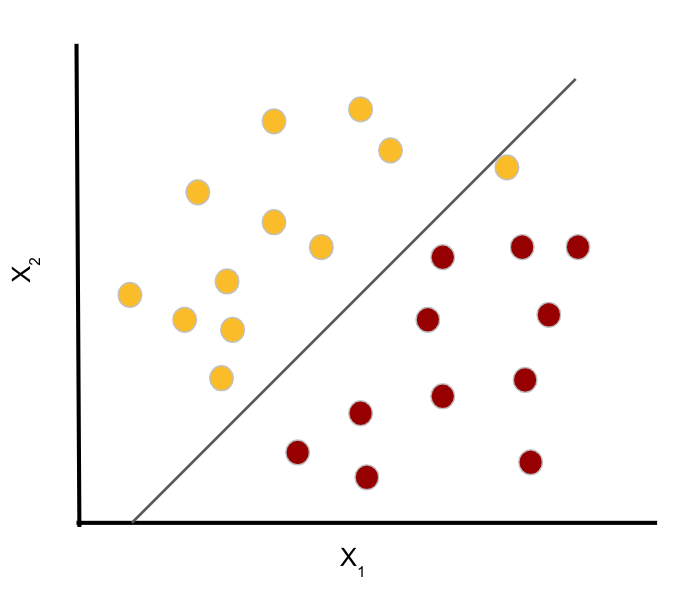
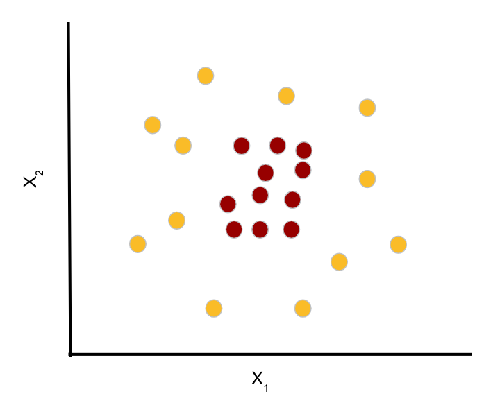
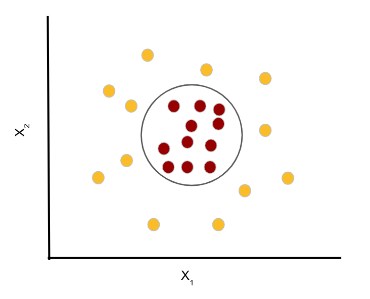

# Support Vector Machines
<!--
Support vector machines (SVM) can be used for both classification and regression tasks. But using SVM for classification is far more common, so in this lecture, we will focus on classification tasks. The lab also focuses mainly on classification but does include a regression example. 
-->

---

# Linear Classification 
## Maximal Margin Classifier 

<!--
A support vector machine is a generalization of a much simpler model called a maximal margin classifier. Let's first discuss the maximal margin classifier. Then we'll see how to extend this simple idea to a more robust support vector machine. 
-->

---

# Hyperplane 
In d-dimensional space, a hyperplane is a "plane" of (d-1) dimensions. 

* In two dimensions, a hyperplane is a line (1-dimensional).
* In three dimensions, a hyperplane is a typical plane (2-dimensional).

## Goal - use a hyperplane to separate data. 
<!--
A hyperplane is the analogue of a line in higher dimensions. If we are looking at d-dimensional space, then a hyperplane has dimension d-1. 

For example, if we look at the typical 2-dimensional Cartesian coordinate system, then a hyperplane is a line. 

Similarly, if we consider 3-dimensional space, then a hyperplane is a 2-dimensional plane. 

Although we cannot visualize this in higher dimensions, the analogy carries through. 

Note that "plane" in the definition refers to an affine subspace. 

-->

---

# Hyperplane Decision Boundary 

<!--
Here we have two classes of observations. Class 1 is shown in yellow, and class 2 is shown in red. They are linearly separated by the hyperplane X_{2} = m*X_{1} + b. Note that this is just the equation of a line. We can rearrange our terms into this equivalent equation: X_{2} - m*X_[1} - b = 0.

Image Details:
* [svm01.png](http://www.google.com): Copyright Google

-->

---
# Notation 
Suppose we have training data with n samples, each consisting of d features. 

We would like to define a separating hyperplane of dimension d-1. 

<!--
Here we have sample data points x_{1} = [x11, x12, ..., x1d], x_{2} = [x21, x22, ..., x2d], and so on. If a separating hyperplane exists, then it cuts our space into d distinct regions. We label the data points based on which region they reside in. 

Let's look back at two dimensions, where we can draw examples. 

Image Details:
* [svm02.png](http://www.google.com): Copyright Google
-->

---

# Separating Hyperplanes 

<!--

Here is the same example data from before, and we have drawn three different separating hyperplanes. 

Notice that any of these hyperplanes can be used to define a classifier. If X_{2} - m*X_{1} - b > 0, then we classify the point as yellow (class 1). If X_{2} - m*X_{1} - b < 0, then we classify the point as red (class 2). 

How do we choose a separating hyperplane? Which one is the "best"? 

Image Details:
* [svm03.png](http://www.google.com): Copyright Google
-->
---

# Maximal Margin Hyperplane

<!--
We compute the Euclidean distance from each data point to the separating hyperplane. The smallest such distance is called the margin. We define the maximal margin hyperplane to be the hyperplane for which the margin is the largest. In other words, we want points from both classes to be as far away from the separating hyperplane as possible.

The data points that define the margin are called the support vectors because they "support" the maximal margin hyperplane. 

Image Details:
* [svm04.png](http://www.google.com): Copyright Google
-->
---

# Soft vs. Hard Margin

<!--
Let's continue to consider the same example, but imagine we receive one additional piece of training data from class 1 (yellow). The new point is the yellow point that is furthest to the right in the graph. We can still define a separating hyperplane, but the margin is tiny. The maximal margin classifier is also known as a hard margin classifier, meaning that points must be perfectly, linearly separated. A hard margin classifier will correctly classify all the training data, but it can be somewhat limiting and not robust to the introduction of new data points. 

Image Details:
* [svm05.png](http://www.google.com): Copyright Google
-->
---

# Soft vs. Hard Margin

<!--
Sometimes it is advantageous to consider a hyperplane that does not perfectly separate all our training data. Here is an example of a soft margin classifier. We see that the yellow data point furthest to the right is incorrectly classified by our model. But we have increased our margin, which can lead to greater robustness and better performance on our test data. 

Image Details:
* [svm06.png](http://www.google.com): Copyright Google
-->
---

# Support Vector Machine
## Soft Margin Classifier 

<!--
A support vector machine is a soft margin classifier. We use the idea of the maximal margin classifier, but we allow for some data points to be incorrectly labeled. The incorrect labeling happens either because our data wasn't linearly separable to begin with, or because we want to increase our margin and reduce overfitting.
-->

---

# Kernel Trick 
## Nonlinear decision boundary

<!--
When the data are not linearly separable, the kernel trick can help us find a decision boundary. 
-->

---

# Kernel: Example

<!--
Consider these data. It is clear that we will never be able to find a decision boundary that is a straight line. We can, however, increase the dimension and define a hyperplane in a higher dimension. 

Here is the main idea:
* transform the features to a higher dimensional space, essentially allowing extra dimensions for non-linearity.

* use a linear svm in the higher dimension to create a linear decision boundary. 

* transform the linear decision boundary back to our original feature space to obtain a non-linear boundary. 

In this example, it's pretty clear that a circle would be a reasonable boundary. We may try the kernel k((X_{1},X_{2})) = (X_{1}, X_{2}, X_{1}^{2} + X_{2}^{2}). Notice that this maps everything to three-dimensional space. In three dimensions, we can find a linear decision boundary and then pull that back to a non-linear boundary in two dimensions. We get something like this (next slide).

Image Details:
* [svm07.png](http://www.google.com): Copyright Google
-->

---

# Kernel: Example 

<!--
Here is the result of using a kernel with X_{1}^{2} + X_{2}^{2} in the third dimension. 

Image Details:
* [svm07.png](http://www.google.com): Copyright Google
-->

---

# Many Other Kernels
* linear 
* polynomial 
* radial basis function
* sigmoid 
* other custom kernels

<!--
There are many other possible kernel functions. A few of the common ones are listed on this slide. When implementing svm with scikit-learn, the kernel can be treated as a hyperparameter that is tuned with your model. 

Reference: https://scikit-learn.org/stable/modules/svm.html#kernel-functions

-->

---

# Your Turn

<!--
Now let's take a look at the lab, where you will practice building support vector machines. 
-->
