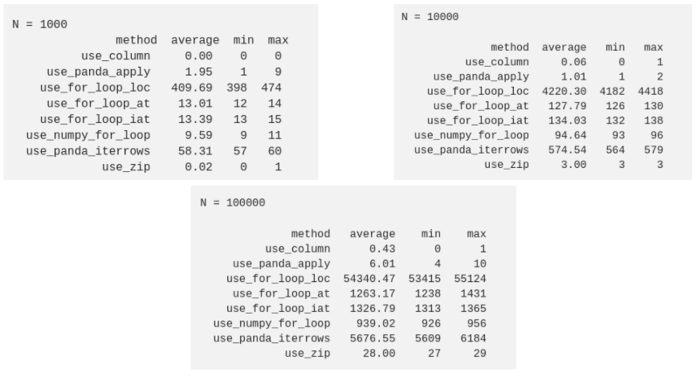
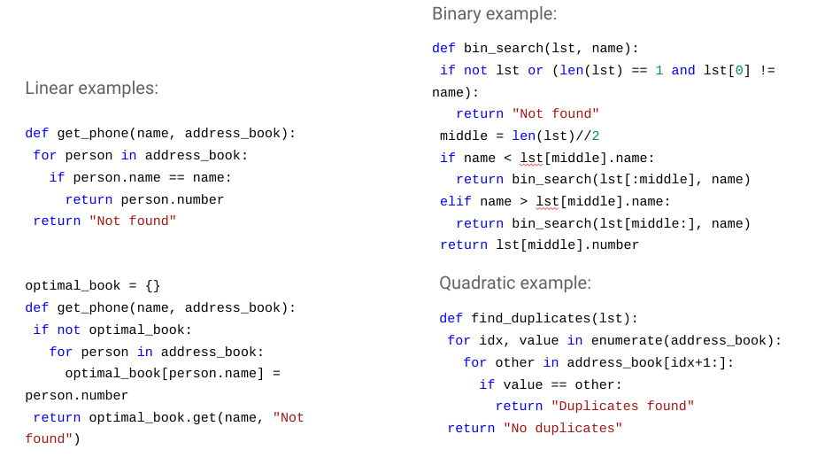

# Big-O

---

# List Operations

Given the following list:

How many operations does it take to insert the integer 100 in the 9th position?

How many operations does it take to check if 63 is in the list?

<!--
First of all, it is important to note that this is a list with 12 unknown items. We know it's not empty, but we don't know what's in each position. 

1.
Lst[8] = 100

1 step
If we had a larger list, would the number of steps change?
No, so we call that constant time.

2.
for item in lst:
	if item == 63:
		print(“Found!”)

Worst case: item not found. Takes 12 steps, where 12 is the length of the list. If we had a larger list, would the number of steps change? Yes! The bigger the list, the more steps. 

We call this linear.

Searching for an item in an unordered list is always at least linear.

*Optional*
Does that change if the list is sorted? Yes! We can do binary search. 

Suggestion: do a binary search example on the board, and calculate how long it takes to search in the worst case (item not found).

Image Details:
* [bigO01.png](http://www.google.com): Copyright Google
-->

---

# Infinite loop vs. very slow algorithm

<!--
*Suggestion: use whiteboard*

Consider the code:

i = 0
while i < len(lst):
	if item == 63:
		print(“Found!”)

What’s the problem?
Infinite loop. It’ll never stop executing…

Sometimes when we are training a model we may seriously start to wonder if we have created an infinite loop. 
How do we know whether we have created an infinite loop or our model is simply taking a long time to train? 

Print statements / debugging messages help us track what’s going on and if any real progress is being made. We can also use these tools to estimate how much time there is left. 

The process of estimating how much time it should take for a piece of code to execute in the worst case is the basis of the concept of Big-O.

Image Details:
* [bigO02.png](http://www.google.com): Copyright Google
-->

---

# Why should I care?

Example: write a function to find all duplicates in a list

<!--
What happens when you ask your computer to try out every possible combination of features?
That’s something we’ll come across a lot when working with big data.

When we write code, we need to be able to tell how much time that code is likely to take to execute based on the size of the
input. Similarly, we need to know whether we have enough space in memory. Otherwise, how would we be able to tell whether you
can run a given dataset through a model on a given computer? Just trying it out and risking running out of memory is not a
good idea! And imagine if we leave our laptop running all day and then we need to close it to go home. Will we just lose all of your progress?
Industry leaders work with problems like this at a much bigger scale. So it’s important to have the language and conceptual understanding of these limitations to be able to work efficiently.

Image Details:
* [bigO03.jpg](https://unsplash.com/photos/rEgveRa_5ds)
-->

---

# Big-O

<!--
Big O is a way to talk about this, to express runtime and space usage.

Image Details:
* [bigO04.png](http://www.google.com): Copyright Google
-->

---

# Example: increment all values within a column by 1

<!--
loc: only work on index
iloc: work on position
ix: You can get data from dataframe without it being in the index
at: get scalar values. It's a very fast loc
iat: Get scalar values. It's a very fast iloc

Image Details:
* [bigO05.png](http://www.google.com): Copyright Google
-->

---

# Time vs. Space

Given a messy address book, write a function to find phone numbers when searching by name.

Note: the names are not sorted.

<!--
time complexity vs space complexity

Alternatives: https://repl.it/repls/SmartSelfreliantMysql
# Option 1: Linear search O(n)
# def get_phone(name, address_book):
#   for person in address_book:
#     if person.name == name:
#       return person.number
# return "Not found"

# Option 2: Sort and binary search O(n log n)
# def get_phone(name, address_book):
#   sorted_book = sorted(address_book)
#   return bin_search(sorted_book, name)

# def bin_search(lst, name):
#   if not lst or (len(lst) == 1 and lst[0] != name):
#     return "Not found"
#   middle = len(lst)//2
#   if name < lst[middle].name:
#     return bin_search(lst[:middle], name)
#   elif name > lst[middle].name:
#     return bin_search(lst[middle:], name)
#   return lst[middle].number

# Option 3: Hash Table O(n)
# optimal_book = {}
# def get_phone(name, address_book):
#   if not optimal_book:
#     for person in address_book:
#       optimal_book[person.name] = person.number
#   return optimal_book.get(name, "Not found")

# Tests
print(get_phone('Jordan Allen', my_address_book))
print(get_phone('Ju de Heer', my_address_book))

# Test code
class Person:
 def __init__(self, name, number):
   self.name = name
   self.number = number
  def __eq__(self, other):
   """Overrides the default implementation"""
   if isinstance(other, Person):
       return self.name == other.name
   return NotImplemented

 def __lt__(self, other):
   """Overrides the default implementation"""
   if isinstance(other, Person):
       return self.name < other.name
   return NotImplemented

 def __gt__(self, other):
   """Overrides the default implementation"""
   if isinstance(other, Person):
       return self.name > other.name
   return NotImplemented
  def __str__(self):
   return "{} {}".format(self.name, self.number)

my_address_book = [
 Person('Jordan Allen', '415-232-9004'),
 Person('Becky Ohio', '510-346-3473'),
 Person('Austin Power', '301-345-5839'),
 Person('Mary McMillan', '345-353-6324')]

Image Details:
* [bigO06.jpg](https://unsplash.com/photos/na8jHogEXPg): Unsplash License
-->

---

# The friends Θ and Ω

<!--
Compare the idea of asymptotic analysis with finding limits at infinity. We really only care about arbitrarily big numbers.

Give example of O(1) with a 1 million constant vs O(n^2) with a 10 constant multiplier.

def quadratic(lst):
 n = len(lst)
 for i in range(n):
   for j in range(n):
     for k in range(10):
       print("hello")

def constant(lst):
 n = len(lst)
 for i in range(1000000):
   print("hello")

Which is faster?

Explain Omega (lower bound) and Theta (tight bound). Omega defines an asymptotic lower bound on a function. Theta is bounds the funciton both above and below, so theta describes the true asymptotic behavior. 

In both of the cases above, the worst and best case are the same. They are an example of Theta.
In our earlier search example with had a return statement in the for loop. What happens in the best case? What about the worst?
The best and worst case are not the same, so we use Omega and Big-O.

Example: for loops without break statements vs while loop

Explain theta with linear function ( c1* g(x) <= f(x) <= c2 * g(x) )
For example, in our earlier example, if we had:
def quadratic(lst):
 n = len(lst)
 for i in range(n):
   for j in range(n):
     if n > 10:
       for k in range(10):
         print("hello")

This is still Big Theta, because n^2 <= n^2 <= 10 * n^2

But in industry you really only need to know Big O

Image Details:
* [bigO07.png](http://www.cs.utsa.edu/~bylander/cs3343/notes/asymptotic.pdf): Unlicensed
-->

---

# Order of magnitude

Put the following in order:
* O(n)
* O(n log n)
* O(2^n)
* O(log n)
* O(n^2)
* O(1)
* O(n!)

<!--
Highlight most common (1, log n, n, n^2, etc)

Image Details:
* [bigO08.png](http://bigocheatsheet.com/): Unlicensed
-->

---

# List of examples:

<!--
Let's look at these examples together. Can anyone justify why we have labeled these pieces of code as linear, binary, and quadratic? 

*(20 mins) Hand out exercise sheet and give students a chance to work in small groups.*

Image Details:
* [bigO09.png](http://www.google.com): Copyright Google
-->
